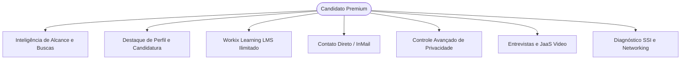

# Workix — Capabilities do Usuário Premium (Candidato & Profissional)

> **Documento Oficial de Especificação de Recursos e Entitlements**  
> **Versão:** 1.0.0 — 2026-09-05  
> **Público-Alvo:** Candidatos, Engenharia, Produto, QA e Suporte  
> **Código do Plano no Sistema:** `candidate_premium_v1`

---

## 1. Visão Geral & Proposta de Valor

O **Workix Premium para Candidatos** é a assinatura voltada para profissionais que buscam acelerar sua recolocação, ganhar visibilidade estratégica diante de recrutadores, obter inteligência sobre como seu perfil é encontrado e capacitar-se continuamente através do ecossistema de aprendizado.



---

## 2. Matriz Comparativa: Free vs. Premium Candidato

| Recurso / Capacidade | Plano Gratuito (Free) | Plano Workix Premium (`candidate_premium_v1`) |
| :--- | :---: | :---: |
| **Quem Visualizou Meu Perfil** | Contagem básica agregada (7 dias) | **Lista nominal detalhada** de empresas, recrutadores e cargos |
| **Rastreabilidade em Buscas** | Não disponível | **Contabilização de aparições em pesquisas** e termos mais buscados |
| **Histórico e Retenção de Métricas** | 7 dias | **12 meses** com série temporal diária/semanal |
| **Selo de Destaque no Perfil** | Não disponível | **Selo Premium Exclusivo** no perfil e buscas |
| **Prioridade de Candidatura** | Padrão | **Destaque prioritário** na lista de inscritos da vaga |
| **Workix Learning (Cursos LMS)** | Cursos públicos básicos | **Acesso ilimitado** a todos os cursos e certificados com verificação |
| **Créditos InMail / Mensagens** | Apenas conexões aceitas | **5 créditos mensais** de abordagem direta a recrutadores |
| **Controle de Processos Ativos** | Compartilhamento padrão | **Controle granular por chave de privacidade** (`reveal()`) |
| **Agendador de Entrevistas & JaaS** | Recebimento passivo | **Gestão de agenda, confirmação e sala de vídeo WebRTC** |
| **Diagnóstico SSI (Social Selling Index)** | Pontuação global | **Relatório analítico dos 4 pilares** com plano de ação |
| **Currículo Normalizado Markdown** | Visualização simples | **Editor avançado com IA e Score de Completude** |

---

## 3. Detalhamento das Capabilities

### 3.1. Visibilidade e Alcance do Currículo (Resume Reach Analytics)

O candidato Premium possui acesso a um dashboard analítico exclusivo em `/analytics/views` e `/analytics/resume-reach`:

* **Identificação de Visualizadores de Perfil**:
  * Identificação se a visita partiu de uma **Empresa/Recrutador** (`RECRUITER_COMPANY`) ou de outro **Profissional** (`CANDIDATE_USER`).
  * Exibição do nome da organização, logotipo corporativo, cargo do recrutador e data/hora da visita.
  * Respeito ao consentimento: caso o visitante navegue em modo anônimo (`show_as_viewed = false`), exibe "Recrutador Anônimo" ou "Usuário Workix" sem quebrar as estatísticas quantitativas.
* **Aparições em Motores de Busca (Search Appearances)**:
  * Registro de quantas vezes o perfil do candidato foi exibido como resultado em buscas de recrutadores no `candidate_search_engine.service.ts`.
  * Ranking das principais palavras-chave, skills e filtros geográficos que levaram os recrutadores até o perfil.
* **Taxa de Conversão & Gráficos Temporais**:
  * Série temporal interativa comparando impressões em buscas vs. cliques/visualizações de currículo.
  * Cálculo da taxa de conversão (Search-to-View Rate).

> [!NOTE]
> Usuários no plano gratuito visualizam cards com contadores gerais e listas com efeito de desfoque (blur) acompanhadas de botão para upgrade Premium.

---

### 3.2. Destaque de Perfil e Impulsionamento de Candidatura (Profile Boost)

* **Selo Premium Oficial**: Distintivo visual dourado no cabeçalho do perfil, nos comentários do feed e nos resultados de busca de talentos.
* **Prioridade de Relevância**: Algoritmo de busca confere peso adicional para perfis Premium completos ao ordenar por relevância de skills.
* **Candidatura em Destaque**: Ao se candidatar a vagas abertas, o perfil aparece no topo da lista do recrutador com a tag "Candidato em Destaque".
* **Selo #OpenToWork Avançado**: Controle independente de visibilidade para indicar disponibilidade para o mercado sem que o atual empregador seja notificado.

---

### 3.3. Workix Learning (LMS & Cursos Ilimitados)

* **Acesso Completo ao Catálogo**: Liberação irrestrita a todos os cursos de qualificação da plataforma Workix e cursos concedidos por empresas parceiras.
* **Player de Vídeo & Materiais Ricos**: Player moderno com controle de velocidade, navegação por módulos/aulas, download de arquivos e PDFs de apoio.
* **Certificados Digitais de Conclusão**: Emissão automática de certificado digital com código de autenticidade único, verificação pública e adição com 1 clique ao perfil e currículo.

---

### 3.4. Comunicação Direta com Recrutadores (InMail & Mensagens)

* **Créditos InMail Mensais**: 5 créditos por mês para iniciar conversas diretas com recrutadores e gerentes de contratação de qualquer empresa, sem necessidade de conexão prévia mútua.
* **Notificação de Interesse**: O candidato recebe notificação em tempo real quando uma empresa desbloqueia seu contato ou telefone.
* **Mensageria com Indicador de Leitura**: Chat em tempo real com confirmação de entrega e leitura.

---

### 3.5. Gestão de Processos Seletivos & Privacidade

* **Painel Minhas Candidaturas**: Acompanhamento em tempo real da etapa do candidato no funil seletivo (Inscrito, Triagem, Entrevista, Proposta, Aprovado).
* **Chave de Compartilhamento de Processos Ativos**:
  * Configuração `share_active_processes_with_recruiters`: Permite ao candidato decidir se empresas Premium autorizadas podem ver que ele está participando de outros processos seletivos.
  * Proteção do Sigilo: Empresas identificadas como concorrentes diretas ou o atual empregador não recebem detalhes sensíveis.

---

### 3.6. Agendador Inteligente de Entrevistas & Videoconferência JaaS

* **Central de Entrevistas**: Visualização de convites com data, horário, pauta e perfil dos entrevistadores.
* **Ações Rápidas**: Confirmar presença, recusar justificando ou solicitar reagendamento de data/hora.
* **Sala de Videoconferência Integrada**: Link direto para a sala virtual corporativa JaaS / WebRTC direto no navegador sem necessidade de instalar aplicativos externos.

---

### 3.7. Social Selling Index (SSI) & Otimização de Perfil

* **Diagnóstico dos 4 Pilares do SSI**:
  1. *Estabelecer sua marca profissional* (completude de perfil, certificados, mídia).
  2. *Localizar as pessoas certas* (pesquisas direcionadas de empresas e tomadores de decisão).
  3. *Interagir com insights* (compartilhamento de posts, reações qualificadas, artigos).
  4. *Construir relacionamentos* (taxa de aceitação de conexões e mensagens diretas).
* **Plano de Otimização**: Recomendações personalizadas para aumentar o índice e o alcance orgânico.

---

## 4. Entitlements & Contrato Técnico (GraphQL)

### Entitlements Ativos no Backend:
* `contact_credits`: 5 créditos/mês (renovação no ciclo de faturamento).
* `profile_boost_enabled`: true.
* `retention_days`: 365 dias.
* `can('VIEW_DETAILED_PROFILE_ANALYTICS')`: true.
* `can('ACCESS_ALL_LMS_COURSES')`: true.

### Principais Queries e Mutations GraphQL:
```graphql
# Consulta de métricas completas de alcance e termos de busca
query GetResumeReachAnalytics($candidateId: ID!, $periodDays: Int) {
  candidateResumeReachAnalytics(candidateId: $candidateId, periodDays: $periodDays) {
    totalProfileViews
    totalSearchAppearances
    uniqueViewersCount
    searchToViewConversionRate
    timeSeries {
      date
      views
      searchAppearances
    }
    topSearchKeywords {
      keyword
      count
    }
    isPremium
  }
}

# Consulta detalhada de quem visualizou o perfil
query GetDetailedProfileViewers($candidateId: ID!, $limit: Int, $offset: Int) {
  candidateProfileViewersDetailed(candidateId: $candidateId, limit: $limit, offset: $offset) {
    totalCount
    isRestricted
    viewers {
      id
      viewerType
      viewerName
      viewerHeadline
      viewerAvatar
      companyId
      companyName
      companyLogo
      viewedAt
      isAnonymous
    }
  }
}

# Acesso e matrícula nos cursos LMS
mutation EnrollCourse($courseId: ID!) {
  enrollInCourse(courseId: $courseId) {
    id
    status
    enrolledAt
  }
}
```

---

## 5. Regras de Privacidade e Segurança (LGPD)

1. **Consentimento e Anonimização**: A identidade do candidato segue estritamente as configurações em `visibility_settings` (`searchable_by_recruiters`, `show_as_viewed`, `share_active_processes_with_recruiters`).
2. **Autorização Server-Side `reveal()`**: A API valida em tempo de execução o escopo de dados solicitado, impedindo qualquer acesso não autorizado.
3. **Retenção e Descarte**: Dados analíticos possuem retenção de 12 meses para contas ativas com rotina periódica de purga de logs antigos.
