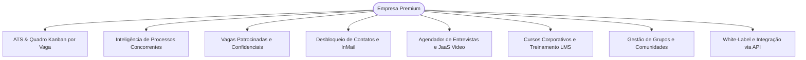

# Workix — Capabilities de Empresas e Recrutadores Premium

> **Documento Oficial de Especificação de Recursos, Planos Corporativos e Entitlements**  
> **Versão:** 1.0.0 — 2026-09-05  
> **Público-Alvo:** Empresas Contratantes, Recrutadores, Engenharia, Produto, Vendas B2B e QA  
> **Códigos dos Planos:** `starter_v1`, `pro_v1`, `business_v1` (com base no `free_v1`)

---

## 1. Visão Geral & Proposta de Valor

O **Workix para Empresas Premium** é a solução completa de *Talent Acquisition* e *Employer Branding* para organizações que buscam atrair os melhores talentos, reduzir o tempo médio de contratação (*Time-to-Hire*), gerenciar o pipeline de candidatos de ponta a ponta e obter inteligência competitiva em tempo real sobre o mercado de trabalho.



---

## 2. Matriz Comparativa de Planos Corporativos

| Recurso / Entitlement | Free (`free_v1`) | Starter (`starter_v1`) | Pro (`pro_v1`) | Business (`business_v1`) |
| :--- | :---: | :---: | :---: | :---: |
| **Investimento Mensal** | R$ 0 | R$ 79,00/mês | R$ 249,00/mês | R$ 699,00/mês |
| **Vagas Ativas Simultâneas** (`max_active_jobs`) | 1 vaga | **3 vagas** | **10 vagas** | **30 vagas** |
| **Usuários / Recrutadores** (`max_users`) | 1 usuário | 1 usuário | **3 usuários** | **10 usuários** |
| **Créditos de Desbloqueio de Contato/Mês** (`contact_credits`) | 0 | **10 créditos** | **60 créditos** | **250 créditos** |
| **Créditos de Vagas Patrocinadas/Mês** (`boost_credits_monthly`) | 0 | **1 crédito** | **5 créditos** | **20 créditos** |
| **Inteligência de Processos Concorrentes** | Bloqueado | **Disponível** | **Disponível** | **Disponível** |
| **Quadro Kanban de Recrutamento (ATS)** | Básico | **Completo** | **Completo + Custom** | **Ilimitado + SLA** |
| **Publicação de Vagas Confidenciais** | Não | **Sim** | **Sim** | **Sim** |
| **Agendador de Entrevistas & JaaS Vídeo** | Não | **Sim** | **Sim** | **Sim** |
| **Criação e Concessão de Cursos LMS** | Apenas consumo | Concessão básica | **Criação + Concessão** | **Trilhas Ilimitadas** |
| **Gestão e Publicação em Grupos** | Não | **Sim** | **Sim** | **Sim** |
| **Acesso a API / Webhooks** (`has_api`) | Não | Não | **Sim** | **Sim** |
| **Retenção Histórica de Dados** (`retention_days`) | 60 dias | 365 dias (1 ano) | 730 dias (2 anos) | **Ilimitado** |
| **Suporte e Atendimento** | Comunidade | E-mail standard | E-mail prioritário | **Gerente de Contas Dedicado** |

---

## 3. Detalhamento das Capabilities

### 3.1. Inteligência de Mercado: Participação do Candidato em Outros Processos

Permite à empresa contratante avaliar a atratividade do candidato no mercado e prever riscos de perda para outras ofertas durante o processo seletivo:

* **Indicador de Atividade**: Informa se o candidato está participando ativamente de outros processos no ecossistema.
* **Volume de Concorrência**: Exibe a quantidade exata de processos seletivos em andamento nos quais o candidato está inscrito.
* **Mapeamento de Posições**: Lista as vagas concorrentes, nomes das empresas contratantes, cargos e datas de inscrição.
* **Etapa Atual do Candidato**: Indica em qual fase o candidato se encontra nos demais processos (ex: *Em Triagem*, *Em Entrevista*, *Proposta Emitida*).
* **Compliance e Consentimento LGPD**: A visualização respeita a chave de consentimento do candidato (`share_active_processes_with_recruiters`) e a função de autorização server-side `reveal()`. Caso o candidato tenha optado por sigilo, a API preserva a privacidade informando o status de restrição.

---

### 3.2. Quadro Kanban de Recrutamento (ATS Completo)

Pipeline visual e dinâmico para acompanhamento de candidaturas em `/recruitment/kanban/:jobId`:

* **Etapas do Funil Customizáveis**:
  * *Inscritos* (Novos candidatos que aplicaram).
  * *Triagem / Qualificação* (Avaliação curricular e match de skills).
  * *Entrevista Técnica / RH* (Entrevistas agendadas).
  * *Proposta* (Oferta formal enviada).
  * *Contratado / Reprovado* (Desfecho do processo seletivo).
* **Movimentação Drag-and-Drop & Auditoria**: Arraste intuitivo de cards entre colunas com registro histórico imutável em `kanban_card_histories` (quem moveu, data/hora e justificativa).
* **Notas Internas e Avaliações**: Espaço colaborativo para os recrutadores da empresa registrarem impressões, notas de 1 a 5 estrelas e feedbacks confidenciais.

---

### 3.3. Publicação de Vagas Confidenciais (Confidential Jobs)

Recurso indispensável para processos de substituição de posições estratégicas ou expansões sigilosas:

* **Proteção de Identidade**: Na listagem pública e no feed, os dados da empresa (nome, logotipo corporativo, endereço e links) são substituídos por "Empresa Confidencial (Setor de Atuação)".
* **Gestão Interna Transparente**: Para a equipe de RH e entrevistadores autorizados da empresa, o painel mantém os dados reais acessíveis.
* **Canal de Comunicação Seguro**: A troca de mensagens e agendamento de entrevistas ocorre com a indicação de confidencialidade preservada até a etapa desejada pelo contratante.

---

### 3.4. Motor de Vagas Patrocinadas & Impulsionamento (Job Boosts)

Acelera a atração de talentos de alta qualificação:

* **Destaque no Topo**: A vaga patrocinada ganha prioridade no motor de busca (`searchJobs`), ocupando slots dedicados acima dos resultados orgânicos.
* **Exposição no Feed Social**: Inserção patrocinada no feed de notícias dos candidatos que possuem as skills demandadas pela vaga.
* **Gestão de Créditos Mensais e Compras Avulsas**: Créditos mensais inclusos no plano (1 no Starter, 5 no Pro, 20 no Business) com possibilidade de aquisição de pacotes avulsos via Pix, Cartão ou Boleto.
* **Integridade do Algoritmo**: Vagas patrocinadas possuem selo transparente "Patrocinada" sem penalizar a relevância natural das vagas orgânicas.

---

### 3.5. Desbloqueio de Contatos e Talent Sourcing (InMail)

* **Busca Ativa de Talentos**: Acesso ao motor de busca avançado com filtros por skills em Markdown, nível de experiência, localização, pretensão e transição de carreira.
* **Desbloqueio com 1 Clique**: Acesso aos telefones diretos, e-mails verificados e download do currículo completo do candidato.
* **Auditoria e Notificação LGPD**: Toda ação de desbloqueio consome 1 crédito e envia notificação imediata ao candidato, garantindo rastreabilidade e consentimento mútuo.

---

### 3.6. Agendador de Entrevistas & Videoconferência JaaS Integrada

* **Convites Sincronizados**: Disparo de convites com data, horário, pauta, links e dados dos entrevistadores.
* **Videoconferência Nativa**: Geração automática de salas virtuais criptografadas via JaaS / WebRTC direto no navegador.
* **Gestão de Status**: Controle em tempo real se o candidato confirmou, recusou ou pediu reagendamento da sessão.

---

### 3.7. Workix LMS Corporativo (Criação e Concessão de Cursos)

* **Criação de Conteúdo Próprio**: Empresas dos planos Pro e Business podem publicar cursos e treinamentos exclusivos na plataforma.
* **Concessão de Cursos a Candidatos**: A empresa pode conceder matrículas gratuitas para candidatos em seus processos seletivos como etapa de teste prático ou qualificação.
* **Certificação Co-Branded**: Emissão de certificados de conclusão chancelados pela empresa contratante.

---

### 3.8. Gestão e Publicação em Grupos e Comunidades Corporativas

* **Criação e Gestão de Grupos**: Exclusividade para perfis de empresas criarem e administrarem comunidades setoriais na plataforma.
* **Publicação de Posts Institucionais e Artigos**: Fomento ao *Employer Branding* com divulgação de cultura organizacional, cases e oportunidades.

---

### 3.9. Selo "Empresa Verificada" & Anti-Vaga-Fantasma Compliance

* **Selo Oficial de Integridade**: Concedido a empresas com CNPJ ativo, domínio corporativo verificado e histórico de engajamento ético.
* **Métricas de Resposta Auditadas**: Exigência de taxa de resposta aos candidatos de pelo menos 80% em até 14 dias para manutenção do selo, gerando maior confiança e atratividade junto aos profissionais.

---

### 3.10. White-Label Branding & Integrações via API

* **Personalização Visual (White-Label)**: Ajuste de logotipo, esquema de cores corporativo e tipografia para portais de vagas dedicados da empresa.
* **Acesso à API GraphQL & REST**: Endpoint protegido para integração direta com sistemas legados, ATS internos (ex: Greenhouse, Workday, Gupy) e ERPs.
* **Webhooks Idempotentes**: Notificações automáticas de novas candidaturas, movimentações de etapa e mensagens de candidatos.

---

## 4. Entitlements & Contrato Técnico (GraphQL & Backend)

### Autorização Server-Side Centralizada (`can()`):
A verificação de permissões é executada de forma estrita pelo `EntitlementsService`:
```typescript
// Exemplo de verificação de permissão no backend
const check = await entitlementsService.can(companyId, 'USE_RECRUITMENT_KANBAN');
if (!check.allow) {
  throw new ForbiddenError(check.reason);
}
```

### Principais Queries e Mutations GraphQL:
```graphql
# Visualização de processos seletivos ativos do candidato
query GetCandidateActiveProcesses($candidateId: ID!) {
  candidateActiveProcesses(candidateId: $candidateId) {
    candidateId
    hasActiveProcesses
    totalCount
    isRestricted
    processes {
      id
      jobTitle
      companyName
      companyLogo
      isConfidential
      status
      currentStage
      subscribedAt
    }
  }
}

# Movimentação de candidato no Kanban ATS
mutation MoveKanbanCandidate($cardId: ID!, $toStage: KanbanStage!, $notes: String) {
  moveKanbanCard(cardId: $cardId, toStage: $toStage, notes: $notes) {
    id
    stage
    movedAt
  }
}

# Desbloqueio de contato do candidato
mutation UnlockCandidate($organizationId: ID!, $userId: ID!, $candidateId: ID!) {
  unlockCandidateContact(
    organizationId: $organizationId
    userId: $userId
    candidateId: $candidateId
  ) {
    unlocked
    unlockedAt
    notifiedAt
    candidate {
      id
      name
      contact {
        mobilePhone
      }
      user {
        email
      }
    }
  }
}

# Publicação de vaga patrocinada ou confidencial
mutation CreateJob($input: JobInput!) {
  createJob(input: $input) {
    id
    title
    isConfidential
    isSponsored
    sponsorLabel
    activated
  }
}
```

---

## 5. Política de Downgrade e Preservação de Dados

* **Degradação Suave (Graceful Downgrade)**: Em caso de cancelamento ou downgrade de plano, o sistema não exclui dados históricos.
* **Arquivamento de Vagas Excedentes**: Vagas que excederem o limite do novo plano são automaticamente pausadas/arquivadas da mais antiga para a mais recente, preservando os dados dos candidatos inscritos.
* **Preservação de Histórico**: Registros de Kanban, histórico de entrevistas e notas de recrutamento permanecem intactos para consultas futuras.
