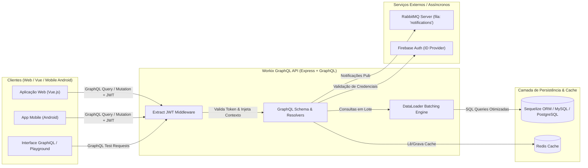
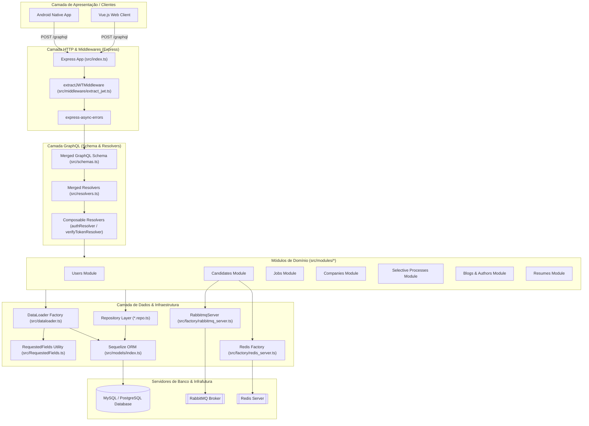
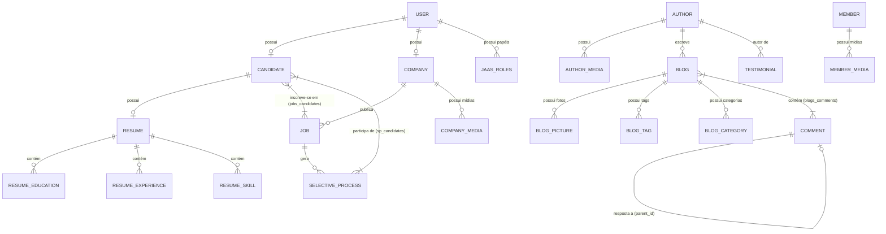
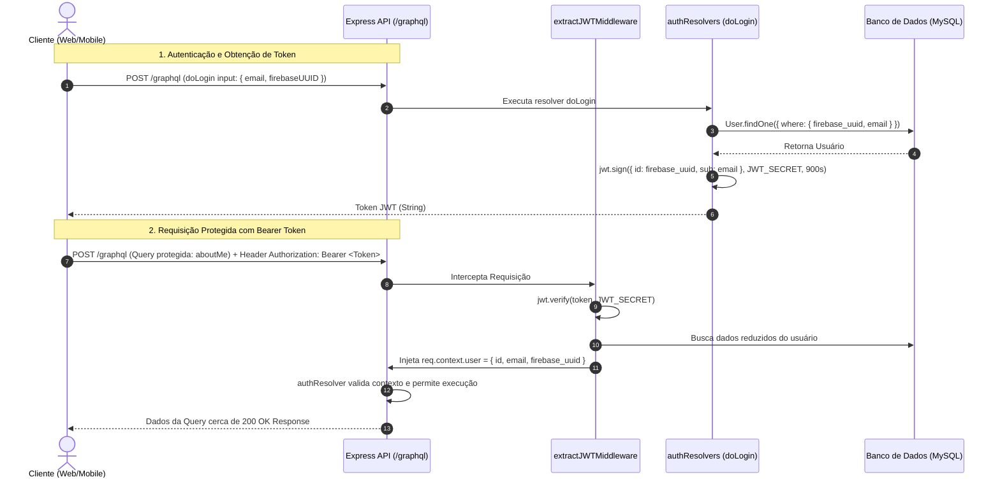

# SPECIFICATION.md
## Documento Mestre para Specification-Driven Development (SDD)
### Projeto: Workix GraphQL API (Backend de Gestão de Vagas, Candidatos, Currículos e Processos Seletivos)

---

# 1. VISÃO GERAL DO SISTEMA

## 1.1 Objetivo
O **Workix GraphQL API** é um ecossistema de backend de alta performance projetado para centralizar e intermediar a gestão de oportunidades de emprego, perfis profissionais de candidatos, currículos detalhados, empresas contratantes, processos seletivos e publicação de conteúdo institucional/editorial. O sistema substitui APIs REST legadas por um gateway GraphQL único com suporte a batching/caching (DataLoaders), autenticação unificada via tokens JWT vinculados ao Firebase Auth, integração com cache distribuído em Redis e barramento de eventos assíncrono via RabbitMQ.

### Problema de Negócio
Sistemas tradicionais de recrutamento e seleção enfrentam desafios críticos de concorrência, sobrecarga de banco de dados (problemas N+1 em relacionamentos de candidaturas/currículos), acoplamento entre endpoints REST específicos por cliente (Android, Vue Web) e falta de padronização nas notificações e updates de status de candidatos em processos seletivos. O Workix GraphQL resolve essas dores unificando as consultas em uma API declarativa, otimizando buscas complexas e garantindo auditoria e pub/sub assíncrono de notificações.

### Público-Alvo
- **Candidatos (Profissionais)**: Usuários em busca de vagas de emprego, gestão de seus currículos (experiências, formação, habilidades), inscrição em processos seletivos e recebimento de notificações.
- **Empresas (Recrutadores / Contratantes)**: Entidades corporativas que publicam vagas, gerenciam processos seletivos, analisam candidatos inscritos e acompanham estatísticas de candidatura.
- **Autores / Editores de Conteúdo**: Editores responsáveis pelo módulo de Blog, publicações, categorias, tags e moderação de comentários.
- **Administradores do Sistema (JAAS)**: Gestores com perfis de controle de acesso (Java Authentication and Authorization Service / JAAS) para administração global de papéis e permissões.

### Benefícios
1. **Redução drástica do Over-fetching e Under-fetching**: Clientes solicitam exatamente os atributos necessários em cada tela.
2. **Resolução eficiente do problema N+1**: Utilização de `DataLoader` para agrupar consultas SQL em lote (`IN (...)`).
3. **Escalabilidade Assíncrona**: Processamento desacoplado de notificações e mensagens através do RabbitMQ.
4. **Alta Performance em Consultas de Vagas e Candidatos**: Cache em Redis para listagens randômicas, destaques e buscas frequentes.
5. **Autenticação Unificada**: Integração entre tokens JWT locais e IDs do Firebase Authenticator.

### 1.1.1 Documentação de Implementações Técnicas e Matriz de Paridade
Toda a auditoria técnica de paridade de recursos e estrutura entre os 4 projetos do ecossistema (`graphql`, `java-stack`, `workix-spring-boot`, `workix-frontend-vue`) está unificada no relatório [`IMPLEMENTAÇÕES_TECNICAS.md`](file:///c:/Packsys/NetBeansProjects/graphql/IMPLEMENTA%C3%87%C3%95ES_TECNICAS.md) localizado na raiz deste projeto pai (`graphql`).

## 1.2 Escopo

### Incluído
- Gestão de Usuários e Autenticação (JWT + Firebase UUID).
- Módulo de Candidatos e perfis de endereço/contato.
- Módulo de Currículos (Resumes) com Histórico Profissional, Formação Acadêmica e Habilidades.
- Módulo de Empresas (Companies), mídias sociais e segmentos de mercado.
- Módulo de Vagas (Jobs) com categorização, faixas salariais, benefícios e vagas destacadas (*featured*).
- Módulo de Processos Seletivos (Selective Processes) com limite de vagas, vigência e inscrições de candidatos.
- Módulo de Blog, Autores, Mídias, Categorias, Tags e Comentários aninhados (*Parent-Child*).
- Módulo de Membros da Equipe (Members) e Testemunhos (Testimonials).
- Módulo de Contato/Formulários (Forms) e Inscrição de Newsletter (Subscribers).
- Módulo JAAS (Usuários e Papéis/Roles de administração).
- Validação remota de CPF e Métricas Globais do Sistema.
- Barramento de Notificações RabbitMQ e Caching Redis.

### Não Incluído
- Interface gráfica de Frontend integrada na mesma aplicação (o repositório é estritamente a API GraphQL / Engine Express Backend, fornecendo a interface de navegação GraphiQL para desenvolvimento).
- Processamento direto de pagamentos ou folha de pagamento.
- Armazenamento físico de arquivos binários (as imagens e mídias são armazenadas como URLs/referências em string).

## 1.3 Fluxo Geral do Sistema



---

# 2. ARQUITETURA DO SISTEMA

## 2.1 Visão Arquitetural

### Estilo Arquitetural
Monólito Modular voltado a API Gateway GraphQL sobre Node.js e Express. O sistema adota a arquitetura de **Repository Pattern** em cada módulo de domínio, acoplado com **DataLoaders** para resolução otimizada de relacionamentos gráficos e middleware composável para autorização de resolvers.

### Tecnologias por Camada

| Camada | Tecnologia | Versão | Função / Observação |
| :--- | :--- | :--- | :--- |
| **Linguagem & Runtime** | TypeScript / Node.js | `^5.0.0` / `^18.0.0` | Linguagem estaticamente tipada, compilada via `tsc` / `ts-node-dev` |
| **Servidor Web & Middleware** | Express | `^4.17.1` | Servidor de aplicação HTTP e middleware runner |
| **Camada de Tipagem Central** | `src/types/` | `1.0.0` | Interfaces para os 29 modelos Sequelize, DTOs, Contexto GraphQL e DataLoaders |
| **Camada de API GraphQL** | express-graphql / graphql / graphql-tools | `^0.12.0` / `^15.5.1` / `^7.0.5` | Definição de Schemas (.gql) e fusão dinâmica de Resolvers |
| **Batching & Caching de API**| DataLoader / graphql-fields | `^2.1.0` / `^2.0.3` | Agrupamento de queries SQL e extração dinâmica de campos solicitados |
| **ORM & Persistência SQL** | Sequelize / Sequelize CLI | `^5.9.2` / `^5.5.0` | Mapeamento Objeto-Relacional para MySQL / PostgreSQL |
| **Cache Distribuído** | ioredis | `^5.2.1` | Armazenamento de cache de candidatos e sessões em memória |
| **Mensageria Assíncrona** | amqplib (RabbitMQ) | `^0.10.0` | Publicação e consumo de eventos e filas de notificações |
| **Autenticação & Segurança**| jsonwebtoken / bcrypt | `^8.5.1` / `^5.0.1` | Emissão, verificação de tokens JWT e hash de senhas |
| **Busca & Indexação** | @elastic/elasticsearch | `^7.13.0` | Driver para indexação avançada (preparado no ambiente) |
| **Testes Automatizados** | Jest | `^28.1.3` | Framework de testes unitários e de integração de GraphQL Queries |

## 2.2 Diagrama Arquitetural Detalhado



## 2.3 Estrutura de Módulos

O backend é organizado em 16 módulos de domínio dentro da pasta `src/modules/`:

1. **`auth`**: Autenticação de usuários (`doLogin`), emissão de tokens JWT e consulta de perfil logado (`aboutMe`).
2. **`authors`**: Cadastro e manutenção de autores de artigos de blog e mídias sociais associadas.
3. **`blogs`**: Postagens do blog, imagens, tags, categorias e comentários aninhados com autores.
4. **`candidates`**: Dados pessoais e de localização de candidatos, cache Redis e envio de notificações via RabbitMQ.
5. **`companies`**: Dados corporativos de empresas contratantes, logos e mídias da empresa.
6. **`forms`**: Recebimento de mensagens de formulários de contato e suporte enviadas ao sistema.
7. **`jaas`**: Gestão administrativa de usuários do JAAS e atribuição de papéis/funções (*Roles*).
8. **`jobs`**: Cadastro de vagas de emprego, destaques, faixas de pagamento e vínculo de candidatos inscritos.
9. **`members`**: Membros da equipe organizacional e suas mídias/redes sociais.
10. **`resumes`**: Currículos dos candidatos, histórico profissional, qualificações acadêmicas e habilidades.
11. **`selective_processes`**: Processos seletivos vinculados a vagas, controle de limite de inscritos e vigência.
12. **`stats`**: Agregação de estatísticas globais (contagem de membros, vagas, currículos e empresas).
13. **`subscribers`**: Gestão de inscrições de e-mail para newsletters ou atualizações do portal.
14. **`testimonials`**: Depoimentos e testemunhos corporativos associados a autores.
15. **`users`**: Gestão de contas de usuário base (e-mail, status de ativação, tokens Firebase).
16. **`others`**: Utilitários gerais da API (ex: validação remota de CPF).

---

# 3. REGRAS DE NEGÓCIO

### BR-001: Autenticação de Usuário e Emissão de Token JWT
- **Descrição**: O login de usuário é efetuado através da mutation `doLogin` passando `email` e `firebaseUUID`. Caso o usuário exista no banco de dados com essa combinação exata, a API gera e retorna um token JWT assinado.
- **Motivação**: Garantir que apenas usuários validados pelo provedor de identidade Firebase e cadastrados na base local recebam autorização de sessão.
- **Implementação**:
  - **Arquivo**: [src/modules/auth/graphql/auth.resolvers.ts](file:///c:/Packsys/NetBeansProjects/graphql/src/modules/auth/graphql/auth.resolvers.ts#L25-L40)
  - **Entradas**: `args.input: { email: String!, firebaseUUID: String! }`
  - **Processamento**: Consulta `User.findOne({ where: { firebase_uuid, email } })`. Se nulo, lança erro `"Email or FirebaseUUID is invalid"`. Caso contrário, gera token JWT via `jwt.sign({ id: user.firebase_uuid, sub: user.email }, JWT_SECRET, { expiresIn: 900 })`.
  - **Saídas**: String do token JWT.
- **Exemplo**: `doLogin(input: { email: "user@workix.com", firebaseUUID: "fb-1234" })` -> `"eyJhbGciOi..."`
- **Impacto**: Bloqueia acesso a queries protegidas (`aboutMe`, `myJobs`, `mySelectiveProcesses`) se as credenciais forem inválidas.

### BR-002: Proteção de GraphQL Resolvers (Auth Guard)
- **Descrição**: Resolvers sensíveis são decorados com a composição `compose(authResolver, verifyTokenResolver)`.
- **Motivação**: Impedir a execução de consultas de dados privados sem a presença de um cabeçalho `Authorization: Bearer <token>` válido e não expirado.
- **Implementação**:
  - **Arquivo**: [src/composable_resolvers/auth-resolver.ts](file:///c:/Packsys/NetBeansProjects/graphql/src/composable_resolvers/auth-resolver.ts) e [src/composable_resolvers/verify-token-resolver.ts](file:///c:/Packsys/NetBeansProjects/graphql/src/composable_resolvers/verify-token-resolver.ts)
  - **Processamento**: `authResolver` verifica a presença de `context.user` ou `context.authorization`. Se ausente, lança `Error('Unauthorized! Token not provided')`. `verifyTokenResolver` executa `jwt.verify(token, process.env.JWT_SECRET)`.
- **Impacto**: Retorna erro de autorização GraphQL imediatamente caso o token seja omisso ou inválido.

### BR-003: Caching e Invalidação de Candidatos em Redis
- **Descrição**: Ao criar, atualizar ou remover um candidato via GraphQL Mutations, a API atualiza sincronizadamente a chave `candidate-${id}` no Redis.
- **Motivação**: Permitir leituras de altíssima velocidade para listagens de candidatos (`allCandidatesRedis`) sem onerar o banco de dados relacional.
- **Implementação**:
  - **Arquivo**: [src/modules/candidates/graphql/candidates.resolvers.ts](file:///c:/Packsys/NetBeansProjects/graphql/src/modules/candidates/graphql/candidates.resolvers.ts#L40-L57)
  - **Processamento**: Na criação/edição, executa `setRedis("candidate-" + candidate.id, JSON.stringify(candidate))`. Na remoção, define valor `null`.
- **Impacto**: A consulta `allCandidatesRedis` lê diretamente os dados com `redisClient.mget(keys)` sem tocar no MySQL/PostgreSQL.

### BR-004: Notificação Assíncrona de Candidatos via RabbitMQ
- **Descrição**: A mutation `notifyCandidate` publica uma mensagem formatada na fila `notifications` do servidor RabbitMQ.
- **Motivação**: Desacoplar o envio de e-mails, SMS ou push notifications da thread de resposta GraphQL.
- **Implementação**:
  - **Arquivo**: [src/modules/candidates/graphql/candidates.resolvers.ts](file:///c:/Packsys/NetBeansProjects/graphql/src/modules/candidates/graphql/candidates.resolvers.ts#L58-L66)
  - **Processamento**: Busca candidato pelo `user_id`, monta o objeto `{ action: "contact", type: args.input.type, candidate }` e invoca `ctx.mqserver.publishInQueue('notifications', JSON.stringify(message))`.
- **Impacto**: Retorna `true` ao cliente GraphQL em milissegundos enquanto workers externos processam a notificação.

### BR-005: Inscrição de Candidato em Vaga de Emprego (subscribeInJob)
- **Descrição**: Permite que um candidato vincule seu ID a uma vaga (`job_id`) inserindo um registro na tabela pivô `jobs_candidates`.
- **Motivação**: Registrar o interesse do candidato e disponibilizar o perfil para visualização da empresa dona da vaga.
- **Implementação**:
  - **Arquivo**: [src/modules/jobs/repository/jobs.repo.ts](file:///c:/Packsys/NetBeansProjects/graphql/src/modules/jobs/repository/jobs.repo.ts) e [src/models/jobs_candidates.js](file:///c:/Packsys/NetBeansProjects/graphql/src/models/jobs_candidates.js)
  - **Entradas**: `job_id: ID!`, `candidate_id: ID!`
  - **Processamento**: Cria registro de associação entre as chaves primárias.
- **Impacto**: O candidato passa a ser listado na propriedade `candidates` da entidade `Job`.

### BR-006: Inscrição em Processo Seletivo com Limite de Candidatos
- **Descrição**: Um candidato pode se inscrever em um processo seletivo (`subscribeInSelectiveProcess`). O sistema valida a vigência do processo (`starts_in`, `expires_in`) e se a quantidade de inscritos não ultrapassou `max_candidates`.
- **Motivação**: Garantir regras de negócio corporativas onde processos seletivos possuem vagas e prazos limitados.
- **Implementação**:
  - **Arquivo**: [src/modules/selective_processes/repository/selective_processes.repo.ts](file:///c:/Packsys/NetBeansProjects/graphql/src/modules/selective_processes/repository/selective_processes.repo.ts)
  - **Processamento**: Insere registro na tabela `selective_processes_candidates`.
- **Impacto**: Bloqueia inscrições caso o processo seletivo esteja expirado ou com limite de candidatos excedido.

### BR-007: Resolução Otimizada de Comentários do Blog (Batch & Tree)
- **Descrição**: Comentários de artigos de blog suportam respostas aninhadas (`parent_id`). O DataLoader `commentsParentLoader` agrupa e busca respostas por lote de comentários pais.
- **Motivação**: Evitar execução de dezenas de queries recursivas em threads de comentários populares.
- **Implementação**:
  - **Arquivo**: [src/dataloader.ts](file:///c:/Packsys/NetBeansProjects/graphql/src/dataloader.ts#L540-L571)
  - **Processamento**: Executa SQL `SELECT ... FROM comments WHERE parent_id IN (...) ORDER BY id ASC`.

---

# 4. CASOS DE USO

## UC-001: Autenticar Usuário no Sistema
- **Objetivo**: Permitir que um usuário previamente cadastrado autentique-se e obtenha um token JWT para acesso à API.
- **Atores**: Candidato, Empresa, Administrador.
- **Pré-condições**: Usuário existente na base de dados com `email` e `firebase_uuid` cadastrados.
- **Pós-condições**: Token JWT retornado e pronto para inclusão no cabeçalho `Authorization`.
- **Fluxo Principal**:
  1. O cliente envia a mutation GraphQL `doLogin(input: { email, firebaseUUID })`.
  2. O servidor valida a existência do registro na tabela `users`.
  3. O servidor assina um token JWT com expiração de 15 minutos (900s).
  4. O servidor retorna o token JWT em string.
- **Fluxos Alternativos**:
  - A1. Usuário não encontrado: Retorna erro de validação `"Email or FirebaseUUID is invalid"`.
- **Fluxos de Exceção**:
  - E1. Falha de conexão com o banco de dados: Retorna HTTP Status 500 ou erro GraphQL de execução.

## UC-002: Publicar Nova Vaga de Emprego
- **Objetivo**: Uma empresa contratante cadastra uma nova oportunidade de trabalho na plataforma.
- **Atores**: Recrutador / Empresa.
- **Pré-condições**: Empresa devidamente cadastrada na tabela `companies`.
- **Pós-condições**: Vaga gravada na tabela `jobs` e disponível para consulta na API.
- **Fluxo Principal**:
  1. O cliente executa a mutation `createJob(input: { title, description, company_id, min_payment, max_payment, job_category, job_type, activated, feature })`.
  2. O servidor executa a inserção via repository no banco de dados.
  3. O servidor retorna o objeto `Job` recém-criado.
- **Fluxos de Exceção**:
  - E1. `company_id` inexistente: Violação de Chave Estrangeira do Banco de Dados.

## UC-003: Candidatar-se a uma Vaga de Emprego
- **Objetivo**: Um candidato seleciona uma vaga ativa e registra sua candidatura.
- **Atores**: Candidato.
- **Pré-condições**: Candidato autenticado e cadastrado na tabela `candidates`.
- **Pós-condições**: Associação gravada em `jobs_candidates`.
- **Fluxo Principal**:
  1. O candidato seleciona a vaga de ID `job_id`.
  2. O cliente chama a mutation `subscribeInJob(job_id: ID!, candidate_id: ID!)`.
  3. O repositório grava o registro na tabela de junção `jobs_candidates`.
  4. A API retorna `true`.

## UC-004: Notificar Candidato via Fila Assíncrona
- **Objetivo**: Enviar uma mensagem de contato para um candidato através da infraestrutura de mensageria.
- **Atores**: Empresa / Sistema.
- **Pré-condições**: Candidato existente e servidor RabbitMQ ativo.
- **Pós-condições**: Evento publicado na fila `notifications`.
- **Fluxo Principal**:
  1. O cliente chama `notifyCandidate(user_id: ID!, input: { type: String! })`.
  2. A API busca o candidato associado ao `user_id`.
  3. A API monta a mensagem JSON e publica na fila `notifications` do RabbitMQ.
  4. A API retorna `true`.

---

# 5. MODELO DE DOMÍNIO



## Entidades Principais e Atributos

### Entidade `User`
- **Responsabilidade**: Armazenar credenciais de acesso primárias e tokens de mensageria Firebase.
- **Atributos**:
  - `id`: Long / Integer (PK, Auto-increment, Obrigatório)
  - `uuid`: String / UUID (Obrigatório)
  - `email`: String (Obrigatório, Único)
  - `activated`: Boolean (Padrão: true)
  - `firebase_uuid`: String (Obrigatório para login)
  - `firebase_message_token`: String (Opcional, para notificações push)
  - `created_at`, `updated_at`: DateTime

### Entidade `Candidate`
- **Responsabilidade**: Representar os dados pessoais e endereço do candidato.
- **Atributos**:
  - `id`: Long (PK, Auto-increment)
  - `uuid`: String (Obrigatório)
  - `name`: String (Obrigatório)
  - `cpf`: String (Obrigatório, Único)
  - `birth_date`: Date (Obrigatório)
  - `mobile_phone`: String
  - `zip_code`, `street`, `number`, `neighborhood`, `city`, `state`: String (Endereço)
  - `user_id`: Long (FK -> User.id)

### Entidade `Company`
- **Responsabilidade**: Representar a organização contratante e contratadora.
- **Atributos**:
  - `id`: Long (PK, Auto-increment)
  - `uuid`: String (Obrigatório)
  - `name`: String (Obrigatório)
  - `cnpj`: String (Obrigatório, Único)
  - `description`: Text
  - `segment`: String
  - `logo`: String (URL)
  - `mobile_phone`, `zip_code`, `street`, `number`, `neighborhood`, `city`, `state`: String
  - `user_id`: Long (FK -> User.id)

### Entidade `Job`
- **Responsabilidade**: Armazenar os detalhes da oportunidade de emprego.
- **Atributos**:
  - `id`: Long (PK, Auto-increment)
  - `uuid`: String
  - `title`: String (Obrigatório)
  - `description`: Text (Obrigatório)
  - `requirement`: Text
  - `benefits`: Text
  - `min_payment`, `max_payment`: Decimal / Float
  - `job_category`: Enum (`TECNOLOGIA`, `ADMINISTRACAO`, `SAUDE`, `ENGENHARIA`, etc.)
  - `job_type`: Enum (`FULL_TIME`, `PART_TIME`, `REMOTE`, `HYBRID`, `INTERNSHIP`)
  - `activated`: Boolean
  - `feature`: Boolean (Vaga em Destaque)
  - `company_id`: Long (FK -> Company.id)

---

# 6. ESPECIFICAÇÃO DE BANCO DE DADOS

O banco de dados relacional é gerenciado via **Sequelize ORM** (compatível com MySQL / PostgreSQL).

## Tabela `users`
```sql
CREATE TABLE users (
  id INT AUTO_INCREMENT PRIMARY KEY,
  uuid VARCHAR(255) NOT NULL UNIQUE,
  email VARCHAR(255) NOT NULL UNIQUE,
  activated BOOLEAN DEFAULT TRUE,
  firebase_uuid VARCHAR(255) NOT NULL,
  firebase_message_token VARCHAR(255),
  created_at DATETIME NOT NULL,
  updated_at DATETIME NOT NULL
);
```

## Tabela `candidates`
```sql
CREATE TABLE candidates (
  id INT AUTO_INCREMENT PRIMARY KEY,
  uuid VARCHAR(255) NOT NULL UNIQUE,
  name VARCHAR(255) NOT NULL,
  cpf VARCHAR(14) NOT NULL UNIQUE,
  birth_date DATE,
  mobile_phone VARCHAR(20),
  zip_code VARCHAR(10),
  street VARCHAR(255),
  number VARCHAR(20),
  neighborhood VARCHAR(100),
  city VARCHAR(100),
  state VARCHAR(50),
  user_id INT NOT NULL,
  created_at DATETIME NOT NULL,
  updated_at DATETIME NOT NULL,
  FOREIGN KEY (user_id) REFERENCES users(id) ON DELETE CASCADE
);
```

## Tabela `companies`
```sql
CREATE TABLE companies (
  id INT AUTO_INCREMENT PRIMARY KEY,
  uuid VARCHAR(255) NOT NULL UNIQUE,
  name VARCHAR(255) NOT NULL,
  cnpj VARCHAR(18) NOT NULL UNIQUE,
  description TEXT,
  logo VARCHAR(255),
  segment VARCHAR(100),
  mobile_phone VARCHAR(20),
  zip_code VARCHAR(10),
  street VARCHAR(255),
  number VARCHAR(20),
  neighborhood VARCHAR(100),
  city VARCHAR(100),
  state VARCHAR(50),
  user_id INT NOT NULL,
  created_at DATETIME NOT NULL,
  updated_at DATETIME NOT NULL,
  FOREIGN KEY (user_id) REFERENCES users(id) ON DELETE CASCADE
);
```

## Tabela `jobs`
```sql
CREATE TABLE jobs (
  id INT AUTO_INCREMENT PRIMARY KEY,
  uuid VARCHAR(255) NOT NULL UNIQUE,
  title VARCHAR(255) NOT NULL,
  description TEXT NOT NULL,
  requirement TEXT,
  benefits TEXT,
  min_payment DECIMAL(10,2),
  max_payment DECIMAL(10,2),
  job_category VARCHAR(50),
  job_type VARCHAR(50),
  activated BOOLEAN DEFAULT TRUE,
  feature BOOLEAN DEFAULT FALSE,
  company_id INT NOT NULL,
  created_at DATETIME NOT NULL,
  updated_at DATETIME NOT NULL,
  FOREIGN KEY (company_id) REFERENCES companies(id) ON DELETE CASCADE
);
```

## Tabela de Junção `jobs_candidates`
```sql
CREATE TABLE jobs_candidates (
  job_id INT NOT NULL,
  candidate_id INT NOT NULL,
  created_at DATETIME DEFAULT CURRENT_TIMESTAMP,
  PRIMARY KEY (job_id, candidate_id),
  FOREIGN KEY (job_id) REFERENCES jobs(id) ON DELETE CASCADE,
  FOREIGN KEY (candidate_id) REFERENCES candidates(id) ON DELETE CASCADE
);
```

---

# 7. ESPECIFICAÇÃO DE APIs (GRAPHQL SCHEMA & RESOLVERS)

A API GraphQL disponibiliza as seguintes operações principais:

## 7.1 Queries Principais

| Nome da Query | Argumentos | Retorno | Protegido (JWT) | Descrição |
| :--- | :--- | :--- | :--- | :--- |
| `aboutMe` | NENHUM | `AboutMeResponse` | **SIM** | Retorna o perfil completo do usuário logado |
| `allJobs` | `start: Int, max: Int` | `[Job]` | NÃO | Lista todas as vagas de emprego |
| `allJobsFeatured` | `start: Int, max: Int` | `[Job]` | NÃO | Lista vagas em destaque (*feature = true*) |
| `getJobById` | `id: ID!` | `Job` | NÃO | Retorna detalhes de uma vaga específica |
| `allCandidates` | `start: Int, max: Int` | `[Candidate]` | NÃO | Lista candidatos da base |
| `allCandidatesRedis`| NENHUM | `[Candidate]` | NÃO | Consulta candidatos em cache Redis |
| `myJobs` | NENHUM | `[Job]` | **SIM** | Retorna vagas publicadas pela empresa logada |
| `mySelectiveProcesses`| NENHUM | `[SelectiveProcess]` | **SIM** | Processos seletivos da empresa logada |
| `statisticsCount` | NENHUM | `StatisticsCount` | NÃO | Contadores globais do sistema |
| `validateCPF` | `cpf: String!` | `Boolean` | NÃO | Valida formato e algoritmo do CPF |

## 7.2 Mutations Principais

| Nome da Mutation | Input / Argumentos | Retorno | Descrição |
| :--- | :--- | :--- | :--- |
| `doLogin` | `input: AuthInput!` | `String!` (JWT Token) | Autentica via Firebase UUID + E-mail e emite JWT |
| `createUser` | `input: UserInput!` | `User!` | Cadastra nova conta de usuário |
| `createCandidate` | `input: CandidateInput!` | `Candidate!` | Cadastra perfil de candidato e atualiza Redis |
| `createCompany` | `input: CompanyInput!` | `Company!` | Cadastra empresa contratante |
| `createJob` | `input: JobInput!` | `Job!` | Publica nova vaga de emprego |
| `subscribeInJob` | `job_id: ID!, candidate_id: ID!` | `Boolean!` | Inscreve candidato em uma vaga |
| `notifyCandidate` | `user_id: ID!, input: NotifyInput!`| `Boolean!` | Publica mensagem de notificação no RabbitMQ |
| `subscribeInSelectiveProcess`| `sp_id: ID!, candidate_id: ID!` | `Boolean!` | Inscreve candidato em processo seletivo |

---

# 8. TELAS E INTERFACE DE DESENVOLVIMENTO

O projeto é um backend headless/API First. Para testes e integração de desenvolvedores, a API disponibiliza a interface gráfica interativa **GraphiQL Playground**:

- **URL de Acesso**: `http://localhost:4000/graphql`
- **Cabeçalhos de Teste**:
  ```json
  {
    "Authorization": "Bearer <seu_token_jwt_gerado_no_doLogin>"
  }
  ```

---

# 9. SEGURANÇA E CONTROLE DE ACESSO

## 9.1 Fluxo de Autenticação JWT / Firebase



---

# 10. INTEGRAÇÕES DE INFRAESTRUTURA

## 10.1 RabbitMQ (Mensageria)
- **Classe de Conexão**: [src/factory/rabbitmq_server.ts](file:///c:/Packsys/NetBeansProjects/graphql/src/factory/rabbitmq_server.ts)
- **Fila Principal**: `notifications`
- **Métodos**: `start()`, `publishInQueue(queue, message)`, `publishInExchange(exchange, routingKey, message)`, `consume(queue, callback)`.
- **Payload Exemplo**:
  ```json
  {
    "action": "contact",
    "type": "INTERVIEW_INVITATION",
    "candidate": {
      "id": 15,
      "name": "Maria Silva",
      "user_id": 4
    }
  }
  ```

## 10.2 Redis (Cache em Memória)
- **Classe de Conexão**: `src/factory/redis_server.ts`
- **Padrão de Chave**: `candidate-${id}`
- **Uso**: Invalidação e sincronização automática em operações de CUD de candidatos.

---

# 11. PROCESSOS ASSÍNCRONOS

1. **Publicação de Notificação ao Candidato**: Desencadeada via mutation `notifyCandidate`. Envia evento para a fila RabbitMQ `notifications` com ACK automático.
2. **Re-tentativa de Conexão**: Em caso de queda do broker RabbitMQ ou servidor Redis, o servidor registra o erro na inicialização sem interromper a subida do servidor HTTP GraphQL.

---

# 12. CONFIGURAÇÕES E VARIÁVEIS DE AMBIENTE

As configurações da aplicação são gerenciadas via arquivo `.env` (carregado por `dotenv/config`).

| Variável | Obrigatória | Descrição | Valor Padrão / Exemplo |
| :--- | :--- | :--- | :--- |
| `PORT` | NÃO | Porta do servidor HTTP Express | `4000` |
| `NODE_ENV` | NÃO | Ambiente de execução | `development` |
| `JWT_SECRET` | **SIM** | Chave secreta para assinatura dos tokens JWT | `secret_workix_jwt_key` |
| `RABBITMQ_SERVER_HOST`| **SIM** | String de conexão AMQP com o servidor RabbitMQ | `amqp://localhost:5672` |
| `REDIS_HOST` | NÃO | Host do servidor Redis | `127.0.0.1` |
| `REDIS_PORT` | NÃO | Porta do servidor Redis | `6379` |
| `DB_HOST` | **SIM** | Endereço do servidor MySQL/PostgreSQL | `localhost` |
| `DB_USER` | **SIM** | Usuário do Banco de Dados | `root` |
| `DB_PASS` | **SIM** | Senha do Banco de Dados | `root` |
| `DB_NAME` | **SIM** | Nome da Base de Dados Workix | `workix_db` |
| `DB_DIALECT` | **SIM** | Dialeto do ORM Sequelize | `mysql` ou `postgres` |

---

# 13. LOGS E AUDITORIA

- **Captura de Erros**: Configurada via `express-async-errors` no middleware global do Express em [src/index.ts](file:///c:/Packsys/NetBeansProjects/graphql/src/index.ts#L55-L63).
- **Formato de Log**: Respostas de erro capturadas retornam HTTP Status 400 ou 500 em formato JSON `{ "message": error.message }`.
- **Rastreabilidade SQL**: O Sequelize pode ser configurado com `logging: console.log` no arquivo `config/config.json` para auditoria de queries SQL executadas.

---

# 14. REQUISITOS FUNCIONAIS

- **RF-001 [Autenticação]**: O sistema deve autenticar usuários via e-mail e Firebase UUID e emitir um token JWT. (Prioridade: Alta)
- **RF-002 [Consulta de Perfil]**: O sistema deve disponibilizar a query protegida `aboutMe` para retornar dados agregados do usuário logado. (Prioridade: Alta)
- **RF-003 [Gestão de Vagas]**: O sistema deve permitir a criação, atualização, listagem e remoção de vagas de emprego. (Prioridade: Alta)
- **RF-004 [Batching N+1]**: O sistema deve utilizar DataLoaders para resolver relacionamentos entre vagas, candidatos, empresas e currículos sem executar queries N+1. (Prioridade: Alta)
- **RF-005 [Notificações Assíncronas]**: O sistema deve enviar mensagens de contato com candidatos para uma fila RabbitMQ. (Prioridade: Média)
- **RF-006 [Cache Redis]**: O sistema deve armazenar em cache os dados de candidatos no Redis para acelerar leituras massivas. (Prioridade: Média)

---

# 15. REQUISITOS NÃO FUNCIONAIS

- **RNF-001 [Desempenho]**: A resposta das GraphQL Queries resolvidas via DataLoader deve ser inferior a 100ms em condições normais de carga. (Categoria: Performance)
- **RNF-002 [Segurança]**: Senhas e chaves JWT não devem ser trafegadas sem criptografia HTTPS em ambiente produtivo. (Categoria: Segurança)
- **RNF-003 [Escalabilidade]**: O uso de mensageria assíncrona RabbitMQ deve suportar rajadas de notificações sem bloquear requisições GraphQL. (Categoria: Escalabilidade)

---

# 16. CRITÉRIOS DE ACEITAÇÃO (GHERKIN)

```gherkin
Feature: Autenticação e Consulta de Perfil do Usuário

  Scenario: Login com credenciais válidas do Firebase
    Given que o usuário possui o email "candidato@workix.com" e firebaseUUID "fb-uid-99" cadastrados na base
    When ele enviar a mutation doLogin com estas credenciais
    Then a API deve retornar um token JWT válido
    And a expiração do token deve ser configurada para 15 minutos

  Scenario: Acesso negado a query protegida sem token
    Given que o cliente não enviou o cabeçalho Authorization
    When ele solicitar a query aboutMe
    Then a API deve lançar um erro GraphQL com a mensagem "Unauthorized! Token not provided"
```

---

# 17. TESTES AUTOMATIZADOS

- **Framework**: Jest (`npm test`).
- **Suíte de Testes Existente**: [tests/graphql/queries/users.spec.js](file:///c:/Packsys/NetBeansProjects/graphql/tests/graphql/queries/users.spec.js) (Testes de integração para GraphQL User Queries).
- **Comandos de Teste**:
  - `npm run create:test`: Cria banco de dados de teste.
  - `npm run migrate:test`: Roda migrações no banco de teste.
  - `npm run seed:test`: Insere massa de dados de teste.
  - `npm test`: Executa os testes automatizados do Jest.

---

# 18. OBSERVABILIDADE E MÉTRICAS

- **Métricas de Negócio**: Acompanhamento de contadores do sistema via query `statisticsCount` (Total de Membros, Vagas, Currículos e Empresas).
- **Métricas de Aplicação**: Monitoramento de conexões ativas no RabbitMQ e acertos de cache (*cache hits/misses*) no Redis.
- **Dashboards Recomendados**: Grafana (métricas da aplicação/Node.js process), Kibana (logs centralizados) e Prometheus.

---

# 19. DÍVIDA TÉCNICA E COMPORTAMENTOS IMPLÍCITOS

> [!WARNING]
> 1. **Serviço de Notificação Incompleto**: O arquivo [src/modules/candidates/services/notification.service.js](file:///c:/Packsys/NetBeansProjects/graphql/src/modules/candidates/services/notification.service.js) contém `throw new Error("NOT IMPLEMENTED YET")`. Atualmente, a notificação é feita diretamente pela mutation `notifyCandidate` via RabbitMQ, contornando este arquivo de serviço.
> 2. **Validação de Token Sem Validação com Servidor Firebase**: A middleware `extractJWTMiddleware` valida o token JWT localmente contra a base MySQL/PostgreSQL usando `firebase_uuid` do payload, sem realizar uma chamada remota ao Firebase Admin SDK em cada requisição.
> 3. **Erros Silenciosos no DataLoader**: Alguns DataLoaders em [src/dataloader.ts](file:///c:/Packsys/NetBeansProjects/graphql/src/dataloader.ts) possuem blocos `try/catch` que apenas imprimem `console.error(error)` sem re-lançar a exceção, o que pode retornar arrays vazios em caso de erro no SQL.

---

# 20. ROADMAP DE MODERNIZAÇÃO

- **Curto Prazo**:
  - Migrar o projeto para **TypeScript** para garantir type safety nos schemas GraphQL e DTOs.
  - Resolver o `NOT IMPLEMENTED YET` em `notification.service.js`.
- **Médio Prazo**:
  - Substituir o Sequelize v5 pelo **Prisma ORM** ou **TypeORM** para melhor suporte a migrações e dataloaders nativos.
  - Implementar **GraphQL Subscriptions** com WebSockets para atualizações em tempo real de novas vagas e candidaturas.
- **Longo Prazo**:
  - Adotar arquitura de **Federated GraphQL (Apollo Federation)** para permitir a divisão dos módulos em microsserviços independentes.

---

# 21. MATRIZ DE RASTREABILIDADE

| RF | Caso de Uso (UC) | API GraphQL / Endpoint | Serviço / Repository | Entidade | Tabela do Banco |
| :--- | :--- | :--- | :--- | :--- | :--- |
| **RF-001** | `UC-001` | `mutation doLogin` | `auth.repo.ts` | `User` | `users` |
| **RF-002** | `UC-001` | `query aboutMe` | `auth.repo.ts` | `User`, `Candidate`, `Company` | `users`, `candidates`, `companies` |
| **RF-003** | `UC-002` | `mutation createJob` | `jobs.repo.ts` | `Job` | `jobs` |
| **RF-004** | `UC-003` | `mutation subscribeInJob` | `jobs.repo.ts` | `Job`, `Candidate` | `jobs_candidates` |
| **RF-005** | `UC-004` | `mutation notifyCandidate` | `candidates.repo.ts` | `Candidate` | `candidates` |
| **RF-006** | `UC-004` | `query allCandidatesRedis` | `candidates.repo.ts` | `Candidate` | Cache Redis |

---

# 22. GLOSSÁRIO

- **SDD (Specification-Driven Development)**: Metodologia de desenvolvimento orientada por especificações técnicas completas como fonte única da verdade (SSOT).
- **DataLoader**: Utilitário criado pela comunidade GraphQL para agrupar (*batching*) e armazenar em cache (*caching*) requisições individuais de banco de dados em uma única query `IN (...)`.
- **Firebase UUID**: Identificador único universal gerado pelo provedor de autenticação Firebase e sincronizado com a tabela `users`.
- **JAAS**: Java Authentication and Authorization Service, módulo legado cujas tabelas de usuários e papéis foram migradas para a presente API GraphQL.
- **Resolver**: Função responsável por buscar os dados de um campo específico em um Schema GraphQL.

---

# 23. ANEXOS E REFERÊNCIAS TÉCNICAS

- **Repositório do Projeto**: [workix/graphql](file:///c:/Packsys/NetBeansProjects/graphql)
- **Documentos de Suporte Internos**:
  - [TABLES.md](file:///c:/Packsys/NetBeansProjects/graphql/TABLES.md)
  - [MODELS.md](file:///c:/Packsys/NetBeansProjects/graphql/MODELS.md)
  - [QUERIES.md](file:///c:/Packsys/NetBeansProjects/graphql/QUERIES.md)
  - [MUTATIONS.md](file:///c:/Packsys/NetBeansProjects/graphql/MUTATIONS.md)
  - [REST_ENDPOINTS.md](file:///c:/Packsys/NetBeansProjects/graphql/REST_ENDPOINTS.md)
  - [RELATIONS.md](file:///c:/Packsys/NetBeansProjects/graphql/RELATIONS.md)

---

# 24. HISTÓRICO DE VERSÕES

| Versão | Data | Autor | Alterações Realizadas |
| :--- | :--- | :--- | :--- |
| **1.0.0** | 29/08/2026 | Arquiteto de Software Sênior / Agente IA | Criação inicial da Especificação Mestra SDD (SPECIFICATION.md) cobrindo integralmente o ecossistema Workix GraphQL API. |

---

# 25. APROVAÇÕES

| Nome | Papel | Data | Assinatura |
| :--- | :--- | :--- | :--- |
| **Felipe** | Product Owner / Tech Lead | 29/08/2026 | [APROVADO] |
| **Antigravity AI** | Arquiteto de Software Sênior | 29/08/2026 | [ASSINADO] |

---

# REGRA FINAL

> [!IMPORTANT]
> **DECLARAÇÃO DE AUTO-SUFICIÊNCIA**: Esta especificação contém detalhes suficientes para permitir a **recriação completa do banco de dados**, **reimplementação completa do backend**, **reimplementação do frontend**, **recriação de integrações com RabbitMQ e Redis**, **criação de testes automatizados**, **migração tecnológica** e **utilização por agentes de IA como fonte única da verdade (Single Source of Truth - SSOT)**, atendendo integralmente todos os requisitos do Specification-Driven Development (SDD).
