# SPECIFICATION_LINKEDIN.md
## Levantamento Técnico Completo de Capabilities do LinkedIn
### Documento de Base (Boot) para Evolução do Ecossistema Workix rumo a um "LinkedIn Clone"

---

# 1. VISÃO GERAL DO LEVANTAMENTO

## 1.1 Objetivo
Este documento complementa o [`SPECIFICATION.md`](file:///c:/Packsys/NetBeansProjects/graphql/SPECIFICATION.md) (fonte da verdade do sistema **Workix** atual) com um levantamento técnico e funcional **completo** das capacidades da plataforma **LinkedIn**, mapeando:

1. **O que já existe** no ecossistema Workix (`graphql`, `java-stack`, `workix-spring-boot`, `workix-frontend-vue`) e pode ser reaproveitado.
2. **O que falta** implementar para que o produto evolua de um "portal de vagas e blog corporativo" para uma **rede social profissional completa**, nos moldes do LinkedIn.
3. **Como implementar** cada capacidade ausente, respeitando a arquitetura já estabelecida (Monólito Modular GraphQL, Repository Pattern, DataLoader, Redis, RabbitMQ, Sequelize).

Este arquivo é o **ponto de partida (boot document)** para as próximas rodadas de *Specification-Driven Development (SDD)*: cada capacidade aqui descrita deverá, quando aprovada para desenvolvimento, gerar sua própria mudança rastreável (ex.: via OpenSpec) com testes TDD antes da implementação, conforme regras do projeto.

## 1.2 Metodologia
- Base funcional do LinkedIn levantada a partir do conhecimento público consolidado sobre a plataforma (perfis, rede, feed, mensagens, vagas, empresas, grupos, eventos, learning, premium, analytics, busca, notificações, privacidade).
- Cada capacidade foi confrontada com o código-fonte atual do módulo `graphql` (16 módulos de domínio, 29 modelos Sequelize, schemas `.gql` em `src/modules/*/graphql/schema.gql`).
- Classificação de cobertura:
  - ✅ **Existe** — funcionalidade implementada e operacional.
  - 🟡 **Parcial** — existe uma base/estrutura análoga, mas incompleta frente ao padrão LinkedIn.
  - ❌ **Não existe** — nenhuma estrutura de dados ou API equivalente.

## 1.3 Escopo Deste Documento

### Incluído
- Levantamento funcional de todas as macro-áreas do LinkedIn (Perfil, Rede, Feed, Mensageria, Notificações, Vagas, Empresas, Grupos, Eventos, Learning, Skills/Endorsements/Recommendations, Busca, Premium/Monetização, Analytics, Privacidade/Moderação, Confiança/Verificação).
- Comparação objetiva com o estado atual do código do projeto `graphql`.
- Sugestão de modelo de dados, schema GraphQL, resolvers, infraestrutura e fases de rollout para cada capacidade ausente.

### Não Incluído
- Implementação de código nesta etapa (este é um documento de planejamento/especificação).
- Decisões finais de UX/UI do frontend Vue (ficam a cargo de um levantamento específico do `workix-frontend-vue`).
- Modelo de precificação comercial (Premium/Recruiter) — apenas a estrutura técnica necessária para suportá-lo é descrita.

---

# 2. ESTADO ATUAL DO SISTEMA WORKIX (RESUMO TÉCNICO)

## 2.1 O Que Já Existe (Reaproveitável)

| Capacidade Genérica | Componente Atual no `graphql` | Reaproveitamento para o Clone LinkedIn |
| :--- | :--- | :--- |
| Autenticação JWT + Firebase | `src/modules/auth`, `extractJWTMiddleware` | Base do login/sessão do futuro "member" LinkedIn-like |
| Perfil de "Candidato" | `src/modules/candidates`, `src/modules/resumes` | Embrião do **Perfil Profissional** (experiência, formação, skills) |
| Perfil de "Empresa" | `src/modules/companies` | Embrião da **Company Page** |
| Vagas de Emprego | `src/modules/jobs` | Já cobre boa parte do módulo **Jobs** do LinkedIn |
| Processos Seletivos | `src/modules/selective_processes` | Análogo ao fluxo de candidatura/pipeline de recrutamento |
| Blog + Comentários Aninhados | `src/modules/blogs`, `comments` (parent_id) | Base técnica reaproveitável para **Posts/Feed** (árvore de comentários já resolvida via DataLoader) |
| Autores + Mídias Sociais | `src/modules/authors`, `author_medias` | Base para vínculo de redes sociais em perfis |
| Membros da Equipe | `src/modules/members` | Não mapeia 1:1 com LinkedIn, mas reaproveitável como "team page" |
| Depoimentos | `src/modules/testimonials` | Estrutura de texto semelhante a **Recommendations**, mas sem vínculo bidirecional membro-a-membro |
| Newsletter/Subscribers | `src/modules/subscribers` | Base para **Newsletters** do LinkedIn (parcial) |
| Cache Redis | `factory/redis_server.ts`, padrão `candidate-${id}` | Infra pronta para cache de feed, perfis e contadores |
| Mensageria RabbitMQ | `factory/rabbitmq_server.ts`, fila `notifications` | Infra pronta para pipeline de **Notificações** assíncronas |
| Elasticsearch (driver instalado, não operacional) | `@elastic/elasticsearch@^7.13.0` | Infra "preparada" ideal para o motor de **Busca (People/Jobs/Companies/Posts)** |
| DataLoader Batching | `src/dataloader.ts` | Padrão a ser estendido para grafos de conexões (rede), feed e reações |
| JAAS (Users/Roles) | `src/modules/jaas` | Base para futura administração/moderação de conteúdo |

## 2.2 O Que Falta (Lacunas Estruturais Frente ao LinkedIn)
- **Nenhum grafo de relacionamento social** (conexões, seguidores, "1º/2º/3º grau").
- **Nenhum modelo de Feed/Post/Reação/Compartilhamento/Hashtag**.
- **Nenhuma mensageria direta (chat) entre usuários** — o que existe é notificação unidirecional empresa→candidato.
- **Nenhum sistema de notificações persistente e consultável** (o RabbitMQ apenas publica, não há tabela de notificações nem query `myNotifications`).
- **Nenhum módulo de Skills/Endorsements/Recommendations vinculando usuários entre si**.
- **Nenhum módulo de Grupos ou Eventos**.
- **Nenhum módulo de Learning/Cursos/Certificações**.
- **Nenhuma camada de Busca full-text real** (Elasticsearch instalado mas não indexado/consultado).
- **Nenhum modelo de Premium/Monetização/Planos**.
- **Nenhuma Analytics de perfil/post** ("quem viu seu perfil", SSI, impressões).
- **Nenhuma infraestrutura de upload/armazenamento de mídia binária** (o projeto trata mídia apenas como URL/string — ver Seção 1.2 "Não Incluído" do `SPECIFICATION.md`).
- **Nenhum suporte a tempo real** (WebSockets/GraphQL Subscriptions) — mencionado apenas como item de roadmap de médio prazo no `SPECIFICATION.md` (Seção 20).

---

# 3. MATRIZ DE PARIDADE DE FUNCIONALIDADES (LINKEDIN × WORKIX)

| # | Macro-Área LinkedIn | Cobertura Atual | Prioridade Sugerida | Complexidade |
| :-: | :--- | :-: | :-: | :-: |
| 1 | Perfil Profissional completo (experiências, formação, skills, sobre, banner, foto) | 🟡 Parcial | Alta | Média |
| 2 | Rede de Conexões (convites, aceite, graus de separação) | ❌ Não existe | **Crítica** | Alta |
| 3 | Seguir (Follow) sem conexão mútua | ❌ Não existe | Alta | Baixa |
| 4 | Feed de Conteúdo (Posts, texto/imagem/vídeo/documento) | ❌ Não existe | **Crítica** | Alta |
| 5 | Reações (like, celebrate, support, love, insightful, funny) | ❌ Não existe | Alta | Baixa |
| 6 | Comentários em Posts (aninhados) | 🟡 Parcial (existe em Blog) | Alta | Baixa (reuso) |
| 7 | Compartilhamento (Repost / Repost com comentário) | ❌ Não existe | Média | Média |
| 8 | Hashtags e Menções (@usuário) | ❌ Não existe | Média | Média |
| 9 | Artigos longos (LinkedIn Articles/Newsletter) | 🟡 Parcial (Blog cobre a base) | Média | Baixa (reuso) |
| 10 | Mensageria Direta (Chat 1:1 e em grupo) | ❌ Não existe | **Crítica** | Alta |
| 11 | InMail (mensagem para não-conectados, Premium) | ❌ Não existe | Baixa | Média |
| 12 | Notificações persistentes e centro de notificações | 🟡 Parcial (infra pub/sub existe, sem persistência/API) | **Crítica** | Média |
| 13 | Vagas de Emprego (listagem, filtros, candidatura) | ✅ Existe | — | — |
| 14 | "Easy Apply" / candidatura simplificada com currículo | 🟡 Parcial (`subscribeInJob` existe, sem anexos) | Alta | Baixa |
| 15 | Alertas de Vaga (Job Alerts) | ❌ Não existe | Média | Média |
| 16 | Open to Work (banner de disponibilidade) | ❌ Não existe | Média | Baixa |
| 17 | Company Pages (seguidores, posts da empresa, vagas vinculadas) | 🟡 Parcial (Company existe, sem seguidores/posts) | Alta | Média |
| 18 | Páginas de Vitrine (Showcase Pages) | ❌ Não existe | Baixa | Média |
| 19 | Grupos (Groups) | ❌ Não existe | Média | Média |
| 20 | Eventos (Events, LinkedIn Live) | ❌ Não existe | Média | Média |
| 21 | LinkedIn Learning (cursos, progresso, certificados) | ❌ Não existe | Baixa | Alta |
| 22 | Skills + Endorsements (validação por terceiros) | ❌ Não existe | Alta | Média |
| 23 | Recommendations (recomendações escritas bidirecionais) | 🟡 Parcial (Testimonial é unidirecional/institucional) | Média | Baixa |
| 24 | Certificações e Licenças no perfil | ❌ Não existe | Média | Baixa |
| 25 | Busca Global (pessoas, vagas, empresas, posts, grupos) | ❌ Não existe (ES não indexado) | **Crítica** | Alta |
| 26 | Filtros avançados de busca (booleana, Sales Navigator) | ❌ Não existe | Baixa | Alta |
| 27 | Quem Visualizou Seu Perfil (Profile Views Analytics) | ❌ Não existe | Média | Média |
| 28 | Analytics de Post (impressões, alcance, cliques) | ❌ Não existe | Média | Média |
| 29 | Social Selling Index (SSI) | ❌ Não existe | Baixa | Alta |
| 30 | Premium / Planos (Career, Business, Sales Navigator, Recruiter) | ❌ Não existe | Baixa | Alta |
| 31 | Privacidade e Configurações de Visibilidade | ❌ Não existe | Alta | Média |
| 32 | Moderação de Conteúdo / Denúncias (Report/Block) | ❌ Não existe | Alta | Média |
| 33 | Verificação de Identidade / Selo Verificado | ❌ Não existe | Baixa | Média |
| 34 | Importação de Currículo/Contatos (CSV, vCard, e-mail) | ❌ Não existe | Baixa | Média |
| 35 | Notificações Push Mobile (Firebase Cloud Messaging) | 🟡 Parcial (`firebase_message_token` já existe no model `User`, sem envio real) | Média | Baixa (reuso) |
| 36 | Recrutamento Avançado (LinkedIn Recruiter: pipelines, tags, notas privadas) | 🟡 Parcial (Selective Process cobre parte) | Média | Média |
| 37 | GraphQL Subscriptions / Tempo real (typing indicator, online status) | ❌ Não existe | Média | Alta |
| 38 | Upload real de mídia (fotos/vídeos/documentos binários) | ❌ Não existe (hoje só URL/string) | **Crítica** (pré-requisito de várias features acima) | Alta |

---

# 4. LEVANTAMENTO DETALHADO DE CAPABILITIES DO LINKEDIN

Cada subseção segue o padrão: **O que é** → **Estado no Workix** → **Como Implementar**.

## 4.1 Perfil Profissional (Profile)

**O que é**: Página central do usuário com foto, banner, headline, seção "Sobre", experiências profissionais, formação acadêmica, skills, licenças/certificações, idiomas, voluntariado, seção "Destaques" (mídias/links fixados), contagem de conexões, "Open to Work", "Providing Services".

**Estado no Workix**: 🟡 Parcial. As entidades `Candidate` + `Resume` + `ResumeExperience` + `ResumeEducation` + `ResumeSkill` já cobrem experiência, formação e habilidades (ver `SPECIFICATION.md` Seção 5). Faltam: foto/banner reais (hoje seria string URL), headline curto, seção "Sobre" (bio longa), idiomas, voluntariado, destaques, contador de conexões, badge "Open to Work".

**Como Implementar**:
- Estender o model `Candidate`/criar `Profile` com campos: `headline`, `about` (TEXT), `banner_url`, `avatar_url`, `open_to_work: BOOLEAN`, `providing_services: BOOLEAN`.
- Novas tabelas: `profile_languages (id, candidate_id, language, proficiency_level)`, `profile_volunteering (id, candidate_id, role, organization, cause, description, start_date, end_date)`, `profile_highlights (id, candidate_id, type, title, url, order)`.
- Novo módulo `src/modules/profiles` seguindo o padrão Repository + DataLoader + `schema.gql` já usado em `resumes`.
- Contador de conexões: campo derivado (não persistido), resolvido via `COUNT` na tabela `connections` (Seção 4.2) com cache Redis (`connections-count-${id}`), reaproveitando o padrão de `BR-003`.

## 4.2 Rede de Conexões (Connections / Network)

**O que é**: Núcleo social do LinkedIn. Usuário envia convite (`Connect`), o outro aceita/recusa; conexões mútuas formam um grafo não-direcionado; existe noção de graus (1º, 2º, 3º+); "Pessoas que você talvez conheça" (People You May Know) é sugerido por grafo + interesses em comum.

**Estado no Workix**: ❌ Não existe nenhuma estrutura de relacionamento usuário-usuário.

**Como Implementar**:
- Novo módulo `src/modules/connections`.
- Tabela `connection_requests (id, requester_id FK->users, receiver_id FK->users, status ENUM('PENDING','ACCEPTED','DECLINED','CANCELED'), message, created_at, updated_at)`.
- Tabela `connections (user_id_a, user_id_b, connected_at)` — par ordenado (menor id primeiro) para evitar duplicidade, com índice único composto.
- Mutations: `sendConnectionRequest(receiver_id, message)`, `acceptConnectionRequest(request_id)`, `declineConnectionRequest(request_id)`, `removeConnection(connection_id)`.
- Queries: `myConnections(start, max)`, `myPendingRequests`, `connectionDegree(target_user_id)` — calculado via BFS limitado a 3 níveis, cacheado em Redis (`degree-${userA}-${userB}`, TTL curto) por ser custoso.
- **"People You May Know"**: job assíncrono (worker consumidor de fila RabbitMQ `network-suggestions`) que calcula interseção de 2º grau + skills em comum, grava resultado pré-computado em tabela `connection_suggestions` para leitura rápida (evita cálculo em tempo real no resolver).
- Ao aceitar conexão, publicar evento em `notifications` (reuso do `BR-004`) para notificar o solicitante.
- DataLoader `connectionsLoader` para resolver `Profile.connections` em lote, seguindo o padrão de `src/dataloader.ts`.

## 4.3 Seguir (Follow)

**O que é**: Relação assimétrica (sem necessidade de aceite) usada para seguir pessoas influentes, empresas ou hashtags, alimentando o feed sem virar "conexão".

**Estado no Workix**: ❌ Não existe.

**Como Implementar**:
- Tabela `follows (follower_id FK->users, followed_type ENUM('USER','COMPANY','HASHTAG'), followed_id, created_at)`.
- Mutations `followEntity` / `unfollowEntity`.
- Reaproveita o mesmo DataLoader pattern de agregação em lote (`followersCountLoader`).

## 4.4 Feed de Conteúdo (Posts)

**O que é**: Núcleo de engajamento. Post com texto rico, imagens múltiplas, vídeo, documento (PDF/carrossel), enquete (poll); feed ranqueado por relevância (não cronológico puro) considerando conexões, interações passadas e "sinais" (afinidade, viralidade).

**Estado no Workix**: ❌ Não existe modelo de Post; existe apenas `Blog` (institucional, vinculado a `Author`, não a qualquer usuário).

**Como Implementar**:
- Novo módulo `src/modules/posts`.
- Tabela `posts (id, uuid, author_user_id FK->users, content TEXT, visibility ENUM('PUBLIC','CONNECTIONS','PRIVATE'), post_type ENUM('TEXT','IMAGE','VIDEO','DOCUMENT','POLL','ARTICLE'), created_at, updated_at)`.
- Tabela `post_media (id, post_id, media_url, media_type, order)` — reaproveita padrão de `blog_pictures`.
- Tabela `post_polls (id, post_id, question, closes_at)` + `post_poll_options` + `post_poll_votes`.
- **Feed Ranking**: dado o custo de um algoritmo de ranking real, sugerir abordagem em 2 fases:
  1. **Fase 1 (MVP)**: feed cronológico dos posts de conexões + seguidos, paginado (`cursor-based pagination`), com cache Redis por usuário (`feed-${userId}`, invalidado a cada novo post de uma conexão via fanout).
  2. **Fase 2 (Ranking)**: introduzir `feed_signals (user_id, post_id, score)` calculado por worker assíncrono (consumidor RabbitMQ) considerando: recência, afinidade (grau de conexão + interações prévias), engajamento (reações/comentários/compartilhamentos).
- Estratégia de **fanout**: para usuários com poucas conexões, fanout-on-write (push do post para o feed de cada seguidor no momento da publicação); para "influenciadores" com muitos seguidores, fanout-on-read (merge em tempo de leitura) — padrão híbrido comum em redes sociais de grande escala.

## 4.5 Reações (Like, Celebrate, Support, Love, Insightful, Funny)

**Estado no Workix**: ❌ Não existe.

**Como Implementar**:
- Tabela `reactions (id, reactable_type ENUM('POST','COMMENT'), reactable_id, user_id, reaction_type ENUM('LIKE','CELEBRATE','SUPPORT','LOVE','INSIGHTFUL','FUNNY'), created_at)` com índice único `(reactable_type, reactable_id, user_id)` para impedir reação duplicada.
- DataLoader `reactionsCountLoader` agrupando por `reactable_id` (mesmo padrão do `commentsParentLoader` citado em `BR-007`).
- Mutation `reactToPost(reactable_type, reactable_id, reaction_type)` (idempotente: se já existe reação do usuário, atualiza o tipo).

## 4.6 Comentários (Comments)

**Estado no Workix**: 🟡 Parcial — a entidade `Comment` já suporta aninhamento via `parent_id` e possui DataLoader otimizado em lote (`commentsParentLoader`, `SPECIFICATION.md` BR-007), mas está acoplada ao domínio `Blog` (`blogs_comments`).

**Como Implementar**:
- Generalizar `Comment` para ser polimórfico: adicionar coluna `commentable_type ENUM('BLOG','POST')` e `commentable_id`, substituindo a FK fixa em `blogs_comments`.
- Reaproveitar 100% do `commentsParentLoader` existente, apenas parametrizando o tipo.
- Migração de dados: linhas existentes de `blogs_comments` recebem `commentable_type = 'BLOG'`.

## 4.7 Compartilhamento (Repost / Quote Repost)

**Estado no Workix**: ❌ Não existe.

**Como Implementar**:
- Tabela `post_shares (id, original_post_id, sharer_user_id, quote_comment TEXT NULL, created_at)`.
- Um repost é renderizado no feed do compartilhador referenciando o post original (não duplica conteúdo).
- Mutation `sharePost(post_id, quote_comment)`.

## 4.8 Hashtags e Menções

**Estado no Workix**: ❌ Não existe (mas `blog_tags` é estruturalmente similar para hashtags de posts institucionais).

**Como Implementar**:
- Tabela `hashtags (id, tag UNIQUE)` + tabela pivô `post_hashtags (post_id, hashtag_id)`.
- Extração automática de `#hashtag` e `@menção` via parser no resolver de criação de post (regex), sem necessidade de o usuário selecionar manualmente.
- Tabela `mentions (id, post_id/comment_id, mentioned_user_id)` para permitir notificação ao usuário mencionado (reuso do pipeline RabbitMQ `notifications`).
- Query `postsByHashtag(tag, start, max)` — candidata natural a indexação no Elasticsearch (Seção 4.13).

## 4.9 Artigos Longos (Articles / Newsletters)

**Estado no Workix**: 🟡 Parcial — `Blog` + `BlogCategory` + `BlogTag` + `BlogPicture` já cobrem um sistema editorial completo; falta apenas permitir que **qualquer usuário** (não só `Author`) publique um artigo e vincular a um "boletim informativo" (newsletter) com assinantes.
**Como Implementar**:
- Reaproveitar o schema `blogs.graphql` quase integralmente, adicionando `newsletter_id` opcional e desacoplando a obrigatoriedade de `author_id` fixo para permitir `user_id` genérico.
- Tabela `newsletters (id, owner_user_id, title, description)` + `newsletter_subscribers (newsletter_id, user_id)` — reaproveita o padrão de `subscribers` já existente no módulo `subscribers`.

## 4.10 Mensageria Direta (Messaging)

**O que é**: Chat privado 1:1 e em grupo, com indicador de "digitando...", confirmação de leitura, envio de mídia/emoji, e o recurso pago **InMail** para contatar quem não é conexão.

**Estado no Workix**: ❌ Não existe. O que existe (`notifyCandidate`) é uma notificação unidirecional empresa→candidato via fila, não um chat bidirecional persistente.

**Como Implementar**:
- Novo módulo `src/modules/messaging`.
- Tabelas: `conversations (id, is_group BOOLEAN, created_at)`, `conversation_participants (conversation_id, user_id, joined_at, last_read_message_id)`, `messages (id, conversation_id, sender_id, content TEXT, media_url NULL, created_at)`.
- **Tempo real é obrigatório aqui**: adotar **GraphQL Subscriptions** (via `graphql-ws` ou `subscriptions-transport-ws`) rodando sobre o mesmo servidor Express/HTTP com upgrade para WebSocket — item já citado como roadmap de médio prazo no `SPECIFICATION.md` (Seção 20) e agora se torna pré-requisito direto.
- Mutation `sendMessage(conversation_id, content)` publica em duas frentes: (1) grava no banco via repository; (2) publica no tópico de subscription para push instantâneo aos participantes conectados.
- Indicador de "digitando" e status online não precisam de persistência — implementar via canal efêmero em Redis Pub/Sub (`ioredis` já é dependência do projeto) com TTL curtíssimo, sem impacto no MySQL/PostgreSQL.
- **InMail**: regra de negócio adicional — mutation `sendMessage` verifica se `receiver` está fora do grafo de conexões (Seção 4.2); se estiver, exige que o remetente possua plano Premium ativo (Seção 4.24) e decrementa um contador mensal de créditos de InMail.

## 4.11 Notificações (Notification Center)

**O que é**: Ícone de sino com lista persistente e paginada de eventos: nova conexão, reação/comentário em post, menção, aniversário de trabalho, vaga recomendada, etc. Suporta também push mobile (FCM) e e-mail digest.

**Estado no Workix**: 🟡 Parcial — existe infraestrutura de publicação (`BR-004`, fila `notifications` do RabbitMQ) mas **nenhuma persistência consultável**: hoje a mensagem é apenas publicada e presumivelmente consumida por um worker externo não documentado no repositório.

**Como Implementar**:
- Novo módulo `src/modules/notifications`.
- Tabela `notifications (id, recipient_user_id, type ENUM('CONNECTION_REQUEST','REACTION','COMMENT','MENTION','JOB_ALERT', ...), payload JSON, read BOOLEAN DEFAULT FALSE, created_at)`.
- Um **worker consumidor** (novo processo, ou consumidor interno via `RabbitmqServer.consume('notifications', callback)` já disponível na classe descrita na Seção 10.1 do `SPECIFICATION.md`) passa a persistir cada evento publicado na tabela acima, além de disparar o envio real via Firebase Cloud Messaging usando o campo `firebase_message_token` do model `User` (que já existe, mas está sem uso ativo de envio — ver Dívida Técnica, Seção 6).
- Queries: `myNotifications(start, max, onlyUnread: Boolean)`, `unreadNotificationsCount`.
- Mutation `markNotificationAsRead(id)` / `markAllNotificationsAsRead`.
- Cache Redis do contador de não-lidas (`unread-notif-${userId}`), invalidado a cada nova notificação/leitura — mesmo padrão de invalidação do `BR-003`.

## 4.12 Vagas de Emprego (Jobs) — Extensões

**Estado no Workix**: ✅ Existe a base (CRUD de `Job`, categorias, tipos, destaque, inscrição via `subscribeInJob`).

**Lacunas e Como Implementar**:
- **Easy Apply com currículo anexado**: hoje `subscribeInJob` apenas cria o vínculo `jobs_candidates`; adicionar campo opcional `resume_snapshot_id` ou `attached_resume_url` na tabela pivô para versionar o currículo enviado naquela candidatura específica.
- **Job Alerts**: tabela `job_alerts (id, user_id, keywords, job_category, city, frequency ENUM('INSTANT','DAILY','WEEKLY'))`; worker agendado (cron) cruza novas vagas com alertas ativos e publica notificação (reuso da Seção 4.11).
- **Open to Work**: campo `open_to_work BOOLEAN` + `open_to_work_visibility ENUM('ALL','RECRUITERS_ONLY')` no perfil (Seção 4.1); resolvers de busca de candidatos priorizam esse flag.
- **"Quem se candidatou" com insights**: query `jobApplicantsInsights(job_id)` agregando dados demográficos anonimizados dos candidatos inscritos (reuso de `StatisticsCount` já existente como padrão de agregação).

## 4.13 Busca Global (Search)

**O que é**: Busca unificada de pessoas, vagas, empresas, posts, grupos com filtros (localização, setor, empresa atual/passada, conexões em comum).

**Estado no Workix**: ❌ Não existe busca full-text real. O driver `@elastic/elasticsearch` está instalado (`package.json`) mas, conforme a própria tabela de tecnologias do `SPECIFICATION.md` (Seção 2.1), está apenas **"preparado no ambiente"**, sem uso efetivo em nenhum resolver.

**Como Implementar**:
- Criar `src/factory/elasticsearch_server.ts` espelhando o padrão de `redis_server.ts`/`rabbitmq_server.ts` já usados (conexão singleton exportada via factory).
- Índices sugeridos: `profiles`, `jobs`, `companies`, `posts`, cada um com um **pipeline de sincronização** disparado nos hooks `afterCreate`/`afterUpdate`/`afterDestroy` do Sequelize (ou via publicação em fila RabbitMQ dedicada `search-index-sync` consumida por um worker que faz o upsert no ES — preferível, para não acoplar latência de indexação à resposta do resolver GraphQL).
- Nova query `globalSearch(term: String!, type: SearchType, start: Int, max: Int): SearchResult` retornando união polimórfica GraphQL (`union SearchResult = Job | Profile | Company | Post`).
- Filtros avançados (booleanos, "conexões em comum") mapeados para `bool` queries do Elasticsearch (`must`, `should`, `filter`).

## 4.14 Company Pages (Páginas de Empresa)

**Estado no Workix**: 🟡 Parcial — `Company` já existe com dados corporativos, mídias e vínculo a vagas (`SPECIFICATION.md` Seção 5, entidade `Company`).

**Lacunas e Como Implementar**:
- **Seguidores da página**: reaproveita a tabela `follows` (Seção 4.3) com `followed_type = 'COMPANY'`.
- **Posts da empresa**: reaproveita `posts` (Seção 4.4) permitindo `author_type ENUM('USER','COMPANY')` e `author_id` polimórfico.
- **Página de Vitrine (Showcase Page)**: tabela `company_showcase_pages (id, parent_company_id, name, description, logo_url)` — sub-páginas vinculadas a uma empresa mãe, com seguidores próprios.
- **Administradores da página**: tabela `company_admins (company_id, user_id, role ENUM('ADMIN','EDITOR'))`.

## 4.15 Grupos (Groups)

**Estado no Workix**: ❌ Não existe.

**Como Implementar**:
- Novo módulo `src/modules/groups`.
- Tabelas: `groups (id, name, description, visibility ENUM('PUBLIC','PRIVATE'), owner_user_id)`, `group_members (group_id, user_id, role ENUM('OWNER','ADMIN','MEMBER'), status ENUM('PENDING','APPROVED'))`, `group_posts` (reaproveita `posts` com `group_id` opcional).
- Mutations: `createGroup`, `requestJoinGroup`, `approveGroupMember`, `postInGroup`.

## 4.16 Eventos (Events)

**Estado no Workix**: ❌ Não existe.

**Como Implementar**:
- Novo módulo `src/modules/events`.
- Tabela `events (id, organizer_user_id ou organizer_company_id, title, description, starts_at, ends_at, is_online BOOLEAN, location/link, cover_image_url)`.
- Tabela `event_attendees (event_id, user_id, status ENUM('INTERESTED','GOING'))`.
- Reaproveita pipeline de notificações (Seção 4.11) para lembretes de evento próximo (worker agendado/cron).

## 4.17 LinkedIn Learning (Cursos e Certificados)

**Estado no Workix**: ❌ Não existe. Maior complexidade e menor prioridade frente ao core social/recrutamento.

**Como Implementar** (visão de alto nível, fase distante):
- Módulo `src/modules/learning` com `courses`, `course_lessons`, `course_enrollments`, `course_completions`.
- Certificados de conclusão exibidos automaticamente na seção "Licenças e Certificações" do perfil (Seção 4.18).
- Armazenamento de vídeo-aula exige, obrigatoriamente, a solução de mídia binária da Seção 5.4 (upload + CDN), não sendo viável apenas com URLs externas manualmente cadastradas.

## 4.18 Skills, Endorsements, Recommendations e Certificações

**Estado no Workix**: 🟡 Parcial — `ResumeSkill` já existe como lista de habilidades autodeclaradas (`SPECIFICATION.md` Seção 5), mas **sem endosso de terceiros** e **sem recomendações bidirecionais**. `Testimonial` existe, mas é uma entidade institucional vinculada a `Author`, não uma recomendação usuário-para-usuário no perfil.

**Como Implementar**:
- **Endorsements**: tabela `skill_endorsements (id, resume_skill_id FK, endorser_user_id FK->users, created_at)` com índice único `(resume_skill_id, endorser_user_id)`; só pode endossar quem é conexão (regra de negócio validada no resolver, reaproveitando a checagem de grafo da Seção 4.2).
- **Recommendations**: tabela `recommendations (id, author_user_id, recipient_user_id, relationship ENUM('MANAGER','COLLEAGUE','CLIENT', ...), content TEXT, status ENUM('PENDING','PUBLISHED','HIDDEN'))` — fluxo: autor escreve, destinatário aprova antes de publicar no próprio perfil (diferente do `Testimonial` atual, que é direto/institucional).
- **Certificações e Licenças**: tabela `profile_certifications (id, candidate_id, name, issuing_organization, issue_date, expiration_date, credential_url)`.

## 4.19 Profile Analytics ("Quem Visualizou Seu Perfil")

**Estado no Workix**: ❌ Não existe.

**Como Implementar**:
- Tabela `profile_views (id, viewer_user_id NULLABLE (anônimo), viewed_user_id, viewed_at)` — gravação assíncrona (publicar em fila RabbitMQ dedicada `profile-views` para não impactar a latência da query `getProfileById`, seguindo o mesmo espírito desacoplado de `BR-004`).
- Query `myProfileViews(period)` agregando contagem por período (semana/mês), com paginação dos últimos visitantes (respeitando configuração de privacidade "navegar anonimamente", Seção 4.22).

## 4.20 Analytics de Post (Impressões/Alcance)

**Estado no Workix**: ❌ Não existe.

**Como Implementar**:
- Tabela `post_impressions (post_id, viewer_user_id NULLABLE, viewed_at)` — mesma estratégia assíncrona da Seção 4.19.
- Agregações materializadas em job noturno (`post_analytics_daily`) para evitar `COUNT` custoso em tempo real sobre tabela de altíssimo volume de escrita.

## 4.21 Social Selling Index (SSI)

**Estado no Workix**: ❌ Não existe. Prioridade baixa — métrica derivada composta (estabelecer marca pessoal + encontrar pessoas certas + engajar com insights + construir relacionamentos), só faz sentido após Seções 4.2, 4.4, 4.10 e 4.19 estarem maduras.

**Como Implementar**: job periódico que calcula score 0-100 combinando: nº de posts publicados, taxa de engajamento recebida, nº de conexões qualificadas (mesmo setor), nº de InMails/mensagens respondidas.

## 4.22 Privacidade e Configurações de Visibilidade

**O que é**: Controle de quem vê e-mail, telefone, status de "Open to Work", navegação anônima em visitas de perfil, quem pode enviar convite de conexão.

**Estado no Workix**: ❌ Não existe nenhuma tabela de preferências de privacidade — hoje toda informação exposta via GraphQL segue apenas o guard binário de autenticação (`BR-002`), sem granularidade por campo.

**Como Implementar**:
- Tabela `privacy_settings (user_id PK, profile_visibility ENUM('PUBLIC','CONNECTIONS','PRIVATE'), show_email BOOLEAN, show_phone BOOLEAN, anonymous_profile_views BOOLEAN, who_can_send_invite ENUM('EVERYONE','SECOND_DEGREE'))`.
- Resolvers de campos sensíveis (`Candidate.mobile_phone`, `email`) passam a checar `privacy_settings` do dono do dado antes de retornar o valor ao solicitante — pode ser implementado como um novo composable resolver, ex. `fieldPrivacyResolver`, no mesmo estilo de `authResolver`/`verifyTokenResolver` já usados (`BR-002`).

## 4.23 Moderação de Conteúdo (Report / Block)

**Estado no Workix**: ❌ Não existe.

**Como Implementar**:
- Tabelas `content_reports (id, reporter_user_id, reportable_type, reportable_id, reason, status ENUM('OPEN','REVIEWED','ACTION_TAKEN'))` e `user_blocks (blocker_user_id, blocked_user_id)`.
- Resolvers de feed/busca/mensageria devem excluir conteúdo/usuários bloqueados via `WHERE NOT IN` (subquery) — aplicar na camada Repository, não no resolver, para garantir consistência entre todos os pontos de entrada.
- Fila de moderação consumida pelo módulo `jaas` (já existente) para dar aos administradores uma superfície de revisão.

## 4.24 Premium / Monetização

**Estado no Workix**: ❌ Não existe.

**Como Implementar** (fase distante, pré-requisito de InMail/Analytics avançado):
- Tabela `subscription_plans (id, name, price, billing_period)` e `user_subscriptions (user_id, plan_id, status, started_at, expires_at)`.
- Middleware/composable resolver `requirePlanResolver(minPlan)` seguindo o mesmo padrão de composição de `compose(authResolver, verifyTokenResolver)` (`BR-002`) para restringir queries premium (ex.: `whoViewedMyProfileFull`, `sendInMail`).
- Integração de pagamento fica fora do escopo técnico deste levantamento (ver `SPECIFICATION.md` Seção 1.2 "Não Incluído" — processamento de pagamentos não faz parte do domínio do backend GraphQL).

## 4.25 Verificação de Identidade / Selo Verificado

**Estado no Workix**: ❌ Não existe.

**Como Implementar**: campo `verified BOOLEAN` + `verification_method ENUM('GOV_ID','WORK_EMAIL','PHONE')` na tabela `users`; fluxo de verificação por e-mail corporativo pode reaproveitar 100% a infraestrutura de token JWT já existente (`BR-001`) gerando um token de confirmação de posse de e-mail de domínio da empresa.

---

# 5. INFRAESTRUTURA TRANSVERSAL NECESSÁRIA

As capacidades acima compartilham 5 blocos de infraestrutura que **precisam ser resolvidos primeiro**, pois todas as demais features dependem deles:

## 5.1 Upload e Armazenamento de Mídia Binária (Bloqueador Crítico)
- **Situação atual**: `SPECIFICATION.md` (Seção 1.2) declara explicitamente que o projeto **não** armazena arquivos binários — apenas referências em string/URL.
- **Necessário para**: foto/banner de perfil, imagens/vídeos de post, documentos de currículo anexado, vídeo-aulas do Learning, logos e mídia de eventos.
- **Sugestão**: introduzir um serviço de armazenamento de objetos (ex.: S3-compatible / Azure Blob Storage) com endpoint de *pre-signed URL*; o GraphQL API expõe uma mutation `requestUploadUrl(fileType, context)` que devolve a URL assinada, e o cliente faz o upload direto ao storage (padrão que evita sobrecarregar o Express com upload multipart). Após o upload, o cliente confirma via mutation `confirmUpload(media_id)`, que grava a referência final na entidade correspondente.

## 5.2 Tempo Real (WebSockets / GraphQL Subscriptions)
- **Necessário para**: Mensageria (4.10), indicador de digitação/online, notificações instantâneas (4.11), atualizações ao vivo do feed.
- Já citado como item de roadmap de médio prazo (`SPECIFICATION.md` Seção 20) — passa a ser **pré-requisito imediato** para o clone LinkedIn, não mais um "nice to have".

## 5.3 Motor de Busca (Elasticsearch Operacional)
- Driver já é dependência instalada (Seção 2.1) porém sem uso. Ativar via `factory/elasticsearch_server.ts` + pipeline de sincronização assíncrona (Seção 4.13).

## 5.4 Grafo de Relacionamentos em Escala
- Para o MVP, o grafo de conexões (Seção 4.2) pode viver inteiramente no banco relacional atual (MySQL/PostgreSQL via Sequelize), com índices compostos. Caso o volume de usuários cresça a ponto de o BFS de "graus de conexão" ficar caro, considerar avaliação futura de um banco de grafos dedicado (Neo4j) — **não recomendado no MVP**, para não introduzir uma nova tecnologia de persistência antes de haver necessidade real comprovada.

## 5.5 Jobs Assíncronos Agendados (Cron/Scheduler)
- Necessário para: Job Alerts (4.12), lembretes de eventos (4.16), agregações de analytics (4.19/4.20), cálculo de SSI (4.21), sugestões de conexão (4.2).
- Sugestão: introduzir `node-cron` (ou similar) como novo processo/worker separado do servidor Express principal, consumindo os mesmos repositories/models via `src/models/index.ts`, mantendo o princípio de não travar o event loop do GraphQL.

---

# 6. NOVO MODELO DE DOMÍNIO PROPOSTO (VISÃO CONSOLIDADA)

```mermaid
erDiagram
    USER ||--o| PROFILE : "estende (Candidate/Resume atual)"
    USER ||--o{ CONNECTION_REQUEST : "envia/recebe"
    USER }|--|{ USER : "conectado a (connections)"
    USER ||--o{ FOLLOW : "segue"
    USER ||--o{ POST : "publica"
    POST ||--o{ REACTION : "recebe"
    POST ||--o{ COMMENT : "recebe (polimórfico)"
    POST ||--o{ POST_SHARE : "é compartilhado em"
    POST ||--o{ POST_HASHTAG : "marcado com"
    USER ||--o{ CONVERSATION_PARTICIPANT : "participa"
    CONVERSATION ||--o{ MESSAGE : "contém"
    USER ||--o{ NOTIFICATION : "recebe"
    USER ||--o{ SKILL_ENDORSEMENT : "endossa"
    USER ||--o{ RECOMMENDATION : "escreve/recebe"
    USER ||--o{ PROFILE_CERTIFICATION : "possui"
    USER ||--o{ GROUP_MEMBER : "participa de"
    GROUP ||--o{ GROUP_MEMBER : "possui"
    USER ||--o{ EVENT_ATTENDEE : "confirma presença"
    COMPANY ||--o{ FOLLOW : "é seguida por"
    COMPANY ||--o{ POST : "publica (páginas)"
    COMPANY ||--o{ COMPANY_ADMIN : "administrada por"
    USER ||--o{ PROFILE_VIEW : "visualiza perfis"
    USER ||--o{ PRIVACY_SETTINGS : "configura"
    USER ||--o{ USER_SUBSCRIPTION : "assina plano"
```

> Este diagrama complementa — sem substituir — o Modelo de Domínio original em `SPECIFICATION.md` (Seção 5). As entidades `USER`, `CANDIDATE`, `COMPANY`, `JOB`, `RESUME` e `COMMENT` já existentes são estendidas, não recriadas.

---

# 7. ROADMAP DE IMPLEMENTAÇÃO POR FASES

## Fase 0 — Fundação (Pré-requisito de tudo)
1. Upload/armazenamento de mídia binária (Seção 5.1).
2. Ativação real do Elasticsearch (Seção 5.3).
3. Introdução de GraphQL Subscriptions / WebSocket (Seção 5.2).
4. Worker de consumo persistente da fila `notifications` (Seção 4.11) — resolve também a dívida técnica já registrada no `SPECIFICATION.md` (Seção 19, item 1: `notification.service.js` com `NOT IMPLEMENTED YET`).

## Fase 1 — Núcleo Social (MVP do "Clone")
1. Rede de Conexões + Follow (Seções 4.2, 4.3).
2. Perfil estendido (headline, sobre, foto/banner, open to work) (Seção 4.1).
3. Feed de Posts + Reações + Comentários polimórficos + Compartilhamento (Seções 4.4–4.7).
4. Notificações persistentes com centro de notificações (Seção 4.11).
5. Mensageria direta 1:1 (Seção 4.10, sem InMail ainda).

## Fase 2 — Diferenciação Profissional
1. Skills Endorsements + Recommendations + Certificações (Seção 4.18).
2. Company Pages com seguidores e posts (Seção 4.14).
3. Job Alerts + Easy Apply aprimorado + Open to Work (Seção 4.12).
4. Busca Global unificada via Elasticsearch (Seção 4.13).
5. Privacidade e Configurações de Visibilidade (Seção 4.22).
6. Moderação (Report/Block) (Seção 4.23).

## Fase 3 — Engajamento e Comunidade
1. Grupos (Seção 4.15).
2. Eventos (Seção 4.16).
3. Hashtags/Menções com indexação de descoberta (Seção 4.8).
4. Profile Analytics ("Quem viu seu perfil") + Analytics de Post (Seções 4.19, 4.20).

## Fase 4 — Monetização e Escala
1. Premium/Planos + InMail (Seção 4.24, 4.10 avançado).
2. LinkedIn Learning (Seção 4.17).
3. Social Selling Index (Seção 4.21).
4. Verificação de Identidade (Seção 4.25).
5. Reavaliação de arquitetura para Apollo Federation, caso o volume justifique divisão em microsserviços — item já presente no roadmap de longo prazo do `SPECIFICATION.md` (Seção 20).

---

# 8. REQUISITOS FUNCIONAIS NOVOS (RF-LKD)

- **RF-LKD-001 [Rede]**: O sistema deve permitir enviar, aceitar e recusar convites de conexão entre usuários. (Prioridade: Crítica)
- **RF-LKD-002 [Rede]**: O sistema deve permitir seguir usuários e empresas sem exigir conexão mútua. (Prioridade: Alta)
- **RF-LKD-003 [Feed]**: O sistema deve permitir a publicação de posts com texto, imagem, vídeo, documento e enquete. (Prioridade: Crítica)
- **RF-LKD-004 [Feed]**: O sistema deve permitir reagir e comentar em posts, com resolução em lote via DataLoader. (Prioridade: Alta)
- **RF-LKD-005 [Mensageria]**: O sistema deve permitir troca de mensagens diretas em tempo real entre conexões. (Prioridade: Crítica)
- **RF-LKD-006 [Notificações]**: O sistema deve persistir e disponibilizar consulta paginada de notificações por usuário. (Prioridade: Crítica)
- **RF-LKD-007 [Busca]**: O sistema deve prover busca full-text unificada de pessoas, vagas, empresas e posts. (Prioridade: Crítica)
- **RF-LKD-008 [Perfil]**: O sistema deve permitir endosso de skills e recomendações escritas entre usuários conectados. (Prioridade: Alta)
- **RF-LKD-009 [Privacidade]**: O sistema deve permitir configuração granular de visibilidade de campos de perfil. (Prioridade: Alta)
- **RF-LKD-010 [Moderação]**: O sistema deve permitir denunciar e bloquear usuários/conteúdo. (Prioridade: Alta)
- **RF-LKD-011 [Mídia]**: O sistema deve suportar upload real de arquivos binários via URL assinada. (Prioridade: Crítica)

# 9. REQUISITOS NÃO FUNCIONAIS NOVOS (RNF-LKD)

- **RNF-LKD-001 [Escalabilidade de Feed]**: A geração do feed deve suportar estratégia híbrida de fanout (push/pull) para não degradar acima de 500ms mesmo para usuários com milhares de seguidores. (Categoria: Performance)
- **RNF-LKD-002 [Tempo Real]**: Mensagens diretas devem ser entregues a participantes conectados em menos de 1 segundo via WebSocket. (Categoria: Performance)
- **RNF-LKD-003 [Consistência de Notificações]**: Nenhuma notificação publicada na fila RabbitMQ pode ser perdida sem persistência — todo consumo deve gravar em banco antes do ACK. (Categoria: Confiabilidade)
- **RNF-LKD-004 [Privacidade]**: Nenhum campo marcado como privado em `privacy_settings` pode vazar em nenhuma query, incluindo buscas agregadas do Elasticsearch (a indexação deve respeitar a mesma regra de visibilidade). (Categoria: Segurança)
- **RNF-LKD-005 [Auditabilidade de Moderação]**: Toda ação de bloqueio/denúncia deve manter trilha auditável e reversível pelo módulo `jaas`. (Categoria: Segurança/Auditoria)

---

# 10. RISCOS E DÍVIDA TÉCNICA A RESOLVER ANTES DE AVANÇAR

> [!WARNING]
> 1. **Serviço de Notificação Incompleto** (já registrado em `SPECIFICATION.md` Seção 19, item 1): o `notification.service.js` com `NOT IMPLEMENTED YET` precisa ser finalizado antes da Fase 0, pois toda a experiência de Notificações/Mensageria do clone depende de um pipeline de consumo confiável da fila `notifications`.
> 2. **Erros Silenciosos em DataLoaders** (Seção 19, item 3 do `SPECIFICATION.md`): antes de estender `src/dataloader.ts` com dezenas de novos loaders (conexões, reações, feed), corrigir os `catch` que hoje engolem exceções (`console.error` sem re-throw), sob risco de o feed retornar silenciosamente vazio em caso de falha de SQL.
> 3. **Ausência de Armazenamento Binário**: bloqueador crítico transversal (Seção 5.1) — deve ser resolvido antes de qualquer feature de mídia (avatar, posts com imagem, anexos de currículo, Learning).
> 4. **Volume de Escrita em Tabelas de Analytics** (`profile_views`, `post_impressions`): projetar desde o início com escrita assíncrona (fila) e agregação em batch, nunca `INSERT` síncrono no caminho crítico do resolver de leitura.

---

# 11. MATRIZ DE RASTREABILIDADE CONSOLIDADA

| RF | Macro-Área (Seção) | Módulo Proposto | Novas Tabelas Principais | Fase |
| :--- | :--- | :--- | :--- | :-: |
| RF-LKD-001 | Rede (4.2) | `connections` | `connection_requests`, `connections` | 1 |
| RF-LKD-002 | Follow (4.3) | `connections` | `follows` | 1 |
| RF-LKD-003 | Feed (4.4) | `posts` | `posts`, `post_media`, `post_polls` | 1 |
| RF-LKD-004 | Reações/Comentários (4.5, 4.6) | `posts` | `reactions`, `comments` (generalizado) | 1 |
| RF-LKD-005 | Mensageria (4.10) | `messaging` | `conversations`, `messages` | 1 |
| RF-LKD-006 | Notificações (4.11) | `notifications` | `notifications` | 0/1 |
| RF-LKD-007 | Busca (4.13) | `search` (infra) | Índices Elasticsearch | 2 |
| RF-LKD-008 | Skills/Recommendations (4.18) | `profiles` | `skill_endorsements`, `recommendations`, `profile_certifications` | 2 |
| RF-LKD-009 | Privacidade (4.22) | `profiles` | `privacy_settings` | 2 |
| RF-LKD-010 | Moderação (4.23) | `jaas` (extensão) | `content_reports`, `user_blocks` | 2 |
| RF-LKD-011 | Mídia (5.1) | infra transversal | Serviço externo de storage + tabela `media_assets` | 0 |

---

# 12. GLOSSÁRIO ADICIONAL

- **Fanout-on-Write / Fanout-on-Read**: estratégias de distribuição de post no feed — push imediato para seguidores (write) vs. montagem do feed no momento da leitura (read).
- **Graus de Conexão**: distância no grafo social entre dois usuários (1º = conexão direta, 2º = conexão de uma conexão, 3º+).
- **InMail**: mensagem paga enviada a um usuário fora da rede de conexões diretas, recurso exclusivo de planos Premium/Recruiter.
- **Easy Apply**: candidatura simplificada a uma vaga usando o perfil/currículo já cadastrado, sem redirecionamento a site externo.
- **SSI (Social Selling Index)**: métrica composta do LinkedIn (0-100) que mede a efetividade de um perfil em construir marca, encontrar pessoas certas, engajar com insights e construir relacionamentos.
- **Showcase Page**: sub-página de uma Company Page dedicada a uma linha de produto/serviço específica, com seguidores próprios.

---

# 13. HISTÓRICO DE VERSÕES

| Versão | Data | Autor | Alterações Realizadas |
| :--- | :--- | :--- | :--- |
| **1.0.0** | 29/08/2026 | Arquiteto de Software Sênior / Agente IA | Criação do levantamento completo de capabilities do LinkedIn e matriz de paridade/gap analysis frente ao ecossistema Workix, servindo de documento de boot (`SPECIFICATION_LINKEDIN.md`) para as próximas mudanças rastreáveis do projeto. |

---

# 14. APROVAÇÕES

| Nome | Papel | Data | Assinatura |
| :--- | :--- | :--- | :--- |
| **Felipe Rodrigues Michetti** | Product Owner / Tech Lead | 29/08/2026 | [PENDENTE DE APROVAÇÃO] |
| **Antigravity AI** | Arquiteto de Software Sênior | 29/08/2026 | [ASSINADO] |

---

# NOTA FINAL

> [!IMPORTANT]
> Este documento é um **levantamento e proposta técnica** — nenhuma implementação de código, migração de banco de dados ou nova dependência foi realizada nesta etapa. Conforme as regras do projeto (`CLAUDE.md`), qualquer modificação de estrutura de banco decorrente deste levantamento deverá ser previamente notificada e aprovada, e cada capacidade aqui descrita deverá seguir o fluxo TDD (testes antes da implementação) e commits em baby-steps ao ser efetivamente desenvolvida.
