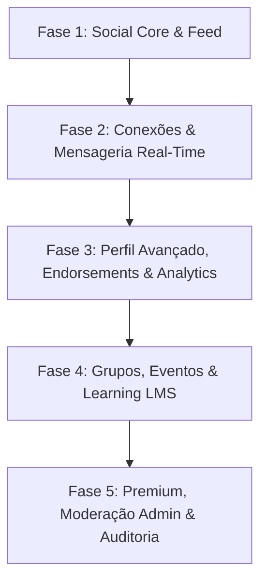

# TODO.md — Mapeamento Geral de Paridade e Roadmap de Implementação
## Ecossistema Workix: Backend GraphQL vs. Frontend Cliente, Frontend Admin e Android

> **Data de Levantamento**: 31 de Agosto de 2026 (Atualizado após implementação de Endossos e Recomendações)  
> **Projeto Maestro**: `graphql` (`D:\Packsys\NetBeansProjects\graphql`)  
> **Documentos de Referência**: [`SPECIFICATION.md`](file:///d:/Packsys/NetBeansProjects/graphql/SPECIFICATION.md), [`SPECIFICATION_LINKEDIN.md`](file:///d:/Packsys/NetBeansProjects/graphql/SPECIFICATION_LINKEDIN.md), [`FRONTEND_GRAPHQL_MAPPING.md`](file:///d:/Packsys/NetBeansProjects/graphql/FRONTEND_GRAPHQL_MAPPING.md)

---

## 1. Sumário Executivo e Diagnóstico de Cobertura

O backend do ecossistema Workix possui **32 módulos de domínio** implementados no projeto maestro `graphql`, cobrindo tanto o núcleo de recrutamento e seleção (Core Workix) quanto os pilares de uma rede social profissional moderna (LinkedIn Clone: Feed Social, Conexões, Chat em Tempo Real, Notificações, Perfis Ricos, Portfólio de Destaques, Endossos de Competências, Recomendações Sociais, LMS/Cursos, Grupos, Eventos, Assinaturas Premium, Analytics e SSI).

As interfaces de usuário (**Frontend Cliente**, **Frontend Admin** e **Android App**) concluíram a implementação do escopo de recrutamento básico, da **Fase 1 (Social Core & Feed)**, da **Fase 2 (Rede, Conexões, Mensageria & Notificações)** e das partes 1 e 2 da **Fase 3 (Perfis Ricos, Destaques, Endossos de Competências e Recomendações)**.

### 📊 Indicadores de Paridade Funcional por Plataforma

```
Backend GraphQL (32 Módulos)     ████████████████████████████████ 100% (32/32 Módulos)
Frontend Cliente (Web Vue 3)     ██████████████████░░░░░░░░░░░░░░  56% (18/32 Módulos)
Frontend Admin (Web Vuetify 3)   █████████████░░░░░░░░░░░░░░░░░░░  41% (13/32 Módulos)
Android App (Kotlin Nativo)      █████████████████░░░░░░░░░░░░░░░  53% (17/32 Módulos)
```

---

## 2. Matriz Consolidada de Paridade (32 Módulos do Backend)

Legenda de Status:
- ✅ **Implementado**: Funcionalidade completa com tela, fluxo e integração ativa.
- 🟡 **Parcial**: Estrutura iniciada ou apenas consumo via REST/mocks parciais, sem cobertura completa de UI/GraphQL.
- ❌ **Pendente**: Não possui tela, store, service ou componente implementado no cliente.

| # | Módulo Backend | Capabilities GraphQL Principais | Frontend Cliente (`frontend/client`) | Frontend Admin (`frontend/admin`) | Android App (`android/`) |
| :-: | :--- | :--- | :---: | :---: | :---: |
| **01** | `auth` | `doLogin`, `aboutMe`, Firebase Auth, JWT | ✅ Implementado | ✅ Implementado | ✅ Implementado |
| **02** | `users` | `allUsers`, `getUserById`, `createUser`, `updateUser`, `deleteUser` | ✅ Implementado (`RegisterView`) | ✅ Implementado (`AdminUsersView`) | ✅ Implementado (`RegisterActivity`) |
| **03** | `jobs` | `allJobs`, `getJobById`, `myJobs`, `createJob`, `updateJob`, `subscribeInJob` | ✅ Implementado (`JobsList`, `JobDetail`, `PostJob`) | ✅ Implementado (`AdminJobsView`) | ✅ Implementado (`JobsList`, `JobDetail`, `PostJob`) |
| **04** | `candidates` | `allCandidates`, `getCandidateById`, `createCandidate`, `notifyCandidate` | ✅ Implementado (`CandidatesList`, `CandidateDetail`) | ✅ Implementado (`AdminCandidatesView`) | ✅ Implementado (`CandidatesList`, `CandidateDetail`) |
| **05** | `resumes` | `allResumes`, `getResumeById`, `createResume`, `updateResume`, `deleteResume` | ✅ Implementado (`PostResumeView`, `CandidateDetail`) | 🟡 Parcial (via `AdminCandidatesView`) | ✅ Implementado (`PostResumeActivity`) |
| **06** | `companies` | `allCompanies`, `getCompanyById`, `createCompany`, `listRandomLogos` | ✅ Implementado (`CompanyDetailView`) | ✅ Implementado (`AdminCompaniesView`) | ✅ Implementado (`CompanyDetailActivity`) |
| **07** | `selective_processes` | `allSelectiveProcesses`, `mySelectiveProcessesSubscribed`, `subscribeInSelectiveProcess` | ✅ Implementado (`MyApplicationsView`) | ❌ Pendente (`AdminSelectiveProcessesView`) | ❌ Pendente (`MyApplicationsFragment`) |
| **08** | `blogs` | `allBlogs`, `getBlogById`, `allBlogsCategories`, `createComment` | ✅ Implementado (`BlogListView`, `BlogPostView`) | ❌ Pendente (`AdminBlogsView`, `AdminCommentsView`) | ✅ Implementado (`BlogListFragment`, `BlogPostActivity`) |
| **09** | `authors` | `allAuthors`, `getAuthorById`, `createAuthor`, `updateAuthor`, `deleteAuthor` | 🟡 Parcial (dados embutidos no Blog) | ❌ Pendente (`AdminAuthorsView`) | 🟡 Parcial (embutido no Blog) |
| **10** | `testimonials` | `allTestimonials`, `getTestimonialById`, `createTestimonial` | ✅ Implementado (`HomeView`) | ✅ Implementado (`AdminTestimonialsView`) | 🟡 Parcial (Home estática) |
| **11** | `subscribers` | `allSubscribers`, `subscribeMail`, `deleteSubscriber` | ✅ Implementado (`TheFooter`) | ✅ Implementado (`AdminSubscribersView`) | 🟡 Parcial (Newsletter na Home) |
| **12** | `jaas` | `allJAASUsers`, `allJAASRoles`, `createJAASRole`, `updateJAASRole` | — (Exclusivo Admin) | ✅ Implementado (`AdminJAASUsers`, `AdminJAASRoles`) | — (Exclusivo Admin) |
| **13** | `stats` | `statisticsCount` | ✅ Implementado (`HomeView`) | ✅ Implementado (`AdminDashboardView`) | 🟡 Parcial (Home) |
| **14** | `forms` | `allForms`, `getFormById`, `createForm`, `deleteForm` | ❌ Pendente (`ContactView`) | ❌ Pendente (`AdminFormsView`) | ❌ Pendente (`ContactActivity`) |
| **15** | `members` | `allMembers`, `getMemberById`, `createMember`, `updateMember`, `deleteMember` | ❌ Pendente (`TeamView`) | ❌ Pendente (`AdminMembersView`) | ❌ Pendente (`TeamFragment`) |
| **16** | `others` | `validateCPF` | 🟡 Parcial (Validação JS local) | 🟡 Parcial (Validação JS local) | 🟡 Parcial (Validação Kotlin local) |
| **17** | `posts` | `socialFeed`, `rankedSocialFeed`, `createPost`, `reactToPost`, `commentOnPost` | ✅ Implementado (`SocialFeedView`, `PostCard`) | ✅ Implementado (`AdminSocialPostsView`) | ✅ Implementado (`SocialFeedFragment`, `PostDetail`) |
| **18** | `connections` | `myConnections`, `pendingConnectionRequests`, `sendConnectionRequest`, `followUser` | ✅ Implementado (`MyNetworkView`, `connectionsStore`) | ✅ Implementado (`connections.service`) | ✅ Implementado (`ConnectionsFragment.kt`) |
| **19** | `messaging` | `directMessages`, `sendDirectMessage`, `Subscription.directMessageAdded` | ✅ Implementado (`MessagingView.vue`, `messagingStore`) | — (Privado de Usuários) | ✅ Implementado (`ChatListFragment`, `DirectChat`) |
| **20** | `notifications` | `myNotifications`, `unreadNotificationsCount`, `Subscription.notificationAdded` | ✅ Implementado (`NotificationsView.vue`, `notificationsStore`) | 🟡 Parcial (Alertas do sistema) | ✅ Implementado (`NotificationsFragment.kt`, FCM) |
| **21** | `profiles` | `getProfileByUserId`, `updateMyProfile` (headline, about, banner, openToWork) | ✅ Implementado (`ProfileEditView`, `PublicProfile`) | 🟡 Parcial (Auditoria de perfis) | ✅ Implementado (`ProfileActivity`, `EditProfile`) |
| **22** | `endorsements` | `skillEndorsements`, `endorseSkill`, `userRecommendations`, `createRecommendation` | ✅ Implementado (`SkillEndorsements`, `Recommendations`) | — (Reputação Comunitária) | ✅ Implementado (`ProfileActivity`, `EndorsementsApi`) |
| **23** | `groups` | `group`, `groupPosts`, `createGroup`, `joinGroup`, `createGroupPost` | ❌ Pendente | ❌ Pendente | ❌ Pendente |
| **24** | `events` | `event`, `eventAttendees`, `createEvent`, `attendEvent` | ❌ Pendente | ❌ Pendente | ❌ Pendente |
| **25** | `learning` | `course`, `courseLessons`, `courseCompletion`, `enrollInCourse`, `completeCourse` | ❌ Pendente | ❌ Pendente | ❌ Pendente |
| **26** | `premium` | `subscriptionPlans`, `mySubscription`, `subscribeToPlan`, `createSubscriptionPlan` | ❌ Pendente | ❌ Pendente | ❌ Pendente |
| **27** | `analytics` | `whoViewedMyProfile`, `postAnalytics`, `recordProfileView`, `recordPostView` | ❌ Pendente | ❌ Pendente | ❌ Pendente |
| **28** | `social_selling`| `mySocialSellingIndex`, `recalculateSocialSellingIndex` | ❌ Pendente | ❌ Pendente | ❌ Pendente |
| **29** | `hashtags` | `postsByHashtag`, `postHashtags` | ✅ Implementado (`HashtagFeedView`, `hashtags.service`) | ✅ Implementado (`AdminSocialPostsView`) | ✅ Implementado (Renderização de tags) |
| **30** | `featured` | `userFeaturedItems`, `addFeaturedItem`, `removeFeaturedItem` | ✅ Implementado (`ProfileEditView`, `PublicProfile`) | — (Portfólio de Usuário) | ✅ Implementado (`ProfilesApiService`) |
| **31** | `job_postings` | `jobPostings`, `jobApplications`, `matchScore`, `applyToJob` | 🟡 Parcial (Usa modelo `jobs` legado) | 🟡 Parcial (Usa modelo `jobs` legado) | 🟡 Parcial (Usa modelo `jobs` legado) |
| **32** | `media` | `requestUploadUrl`, `confirmUpload`, `getMediaById` | ❌ Pendente | ❌ Pendente | ❌ Pendente |

---

## 3. Detalhamento de Pendências por Plataforma

### 3.1. Frontend do Cliente (`frontend/client` — Vue 3 + Pinia + Vite)

#### 🟢 Módulo Social & Feed de Publicações (Concluído)
- [x] **Criar View `SocialFeedView.vue` (`/feed`)**
- [x] **Criar View `HashtagFeedView.vue` (`/hashtag/:tag`)**
- [x] **Criar Store `postsStore.ts` & Service `src/services/posts.service.ts`**

#### 🟢 Módulo Rede & Conexões Profissionais (Concluído)
- [x] **Criar View `MyNetworkView.vue` (`/mynetwork`)**
- [x] **Criar Store `connectionsStore.ts` & Service `src/services/connections.service.ts`**

#### 🟢 Módulo Mensageria Direta & Chat em Tempo Real (Concluído)
- [x] **Criar View `MessagingView.vue` (`/messaging`) & Chat 1:1**
- [x] **Criar Store `messagingStore.ts` & Service `src/services/messaging.service.ts`**

#### 🟢 Módulo Centro de Notificações (Concluído)
- [x] **Criar View `NotificationsView.vue` (`/notifications`) & Menu Dropdown no Header**
- [x] **Criar Store `notificationsStore.ts` & Service `src/services/notifications.service.ts`**

#### 🟢 Módulo Perfil Profissional Avançado & Portfólio de Destaques (Concluído)
- [x] **Criar View `ProfileEditView.vue` (`/profile/edit`) & `PublicProfileView.vue` (`/in/:id`)**
- [x] **Criar Store `profilesStore.ts` & Service `src/services/profiles.service.ts`**

#### 🟢 Módulo Competências (Endorsements) & Recomendações (Concluído)
- [x] **Criar Componentes `SkillEndorsementsSection.vue` & `RecommendationsSection.vue`**
- [x] **Criar Store `endorsementsStore.ts` & Service `src/services/endorsements.service.ts`**

#### 🔴 Módulo Social Selling Index (SSI) & Analytics
- [ ] **Criar View `SocialSellingView.vue` (`/analytics/ssi`)**: Painel com gráficos do índice de Social Selling (`mySocialSellingIndex`, `recalculateSocialSellingIndex`).
- [ ] **Criar View `ProfileAnalyticsView.vue` (`/analytics/views`)**: Dashboard de "Quem visualizou seu perfil" (`whoViewedMyProfile`) e métricas de engajamento de posts (`postAnalytics`).

#### 🔴 Módulo Comunidades, Eventos & Educação (LMS)
- [ ] **Criar View `GroupsListView.vue` (`/groups`) & `GroupDetailView.vue` (`/groups/:id`)**:
  - Exploração de grupos profissionais, solicitação de entrada (`joinGroup`) e feed exclusivo do grupo (`groupPosts`, `createGroupPost`).
  - Modal de criação de grupo (`createGroup`).
- [ ] **Criar View `EventsListView.vue` (`/events`) & `EventDetailView.vue` (`/events/:id`)**:
  - Calendário e listagem de eventos virtuais/presenciais (`event`).
  - Confirmação de presença / RSVP (`attendEvent`, `eventAttendees`).
  - Formulário para publicar novo evento (`createEvent`).
- [ ] **Criar View `CoursesCatalogView.vue` (`/learning`), `CourseDetailView.vue` & `LessonPlayerView.vue`**:
  - Catálogo de cursos profissionais com instrutores e ementa (`course`, `courseLessons`).
  - Inscrição em cursos (`enrollInCourse`).
  - Player de vídeo/aulas com checklist de progresso e emissão de certificado digital (`completeCourse`, `courseCompletion`).

#### 🔴 Módulo Monetização & Assinaturas Premium
- [ ] **Criar View `PremiumPlansView.vue` (`/premium`)**:
  - Tabela comparativa de planos (Free vs Premium Career vs Recruiter) com preços e benefícios (`subscriptionPlans`).
  - Fluxo de contratação / assinatura (`subscribeToPlan`).
  - Exibição de créditos de InMail restantes e status da assinatura ativa (`mySubscription`).

#### 🔴 Módulo Institucional & Suporte
- [ ] **Criar View `ContactView.vue` (`/contact`)**: Formulário de contato e ouvidoria (`createForm`).
- [ ] **Criar View `TeamView.vue` (`/team`)**: Apresentação dos membros da equipe e redes sociais (`allMembers`).
- [ ] **Implementar Upload Direto de Mídia (`src/services/media.service.ts`)**: Integração de upload de arquivos (avatar, banner, anexos de posts e currículos em PDF) utilizando fluxo assíncrono seguro (`requestUploadUrl`, `confirmUpload`).

---

### 3.2. Frontend Administrativo (`frontend/admin` — Vue 3 + Vuetify 3)

#### 🟢 Módulo Moderação de Conteúdo Social & Blogs (Parcialmente Concluído)
- [x] **Criar View `AdminSocialPostsView.vue` (`/admin/social-posts`)**: Painel de moderação para auditoria de posts sociais da comunidade, inspeção de comentários e reações.
- [x] **Criar `connections.service.ts`**: Consulta e auditoria da malha de conexões no admin.
- [ ] **Criar View `AdminBlogsView.vue` (`/admin/blogs`)**:
  - Tabela de gerenciamento de posts do blog corporativo (`allBlogsPaginated`).
  - Modal de criação e edição com editor de texto rico, seleção de autor, categorias e upload de imagem de capa (`createBlog`, `updateBlog`, `deleteBlog`).
- [ ] **Criar View `AdminCommentsView.vue` (`/admin/comments`)**: Moderação centralizada de comentários de posts de blog (`allCommentsPaginated`, `deleteComment`).
- [ ] **Criar View `AdminAuthorsView.vue` (`/admin/authors`)**: CRUD completo de autores do blog (`allAuthors`, `createAuthor`, `updateAuthor`, `deleteAuthor`).
- [ ] **Criar View `AdminHashtagsView.vue` (`/admin/hashtags`)**: Monitoramento de tags em tendência e bloqueio de hashtags proibidas.

#### 🔴 Módulo Gestão Educacional (LMS) & Comunidade
- [ ] **Criar View `AdminCoursesView.vue` (`/admin/courses`)**: Cadastro e edição de cursos, atribuição de instrutor e capa (`createCourse`).
- [ ] **Criar View `AdminGroupsView.vue` (`/admin/groups`)**: Auditoria de grupos públicos e privados.
- [ ] **Criar View `AdminEventsView.vue` (`/admin/events`)**: Gestão de eventos cadastrados na plataforma.

#### 🔴 Módulo Monetização, Planos & Faturamento
- [ ] **Criar View `AdminPlansView.vue` (`/admin/plans`)**: Criação e manutenção de planos de assinatura (`createSubscriptionPlan`), precificação e cotas.

#### 🔴 Módulo Operações Corporativas, Suporte & Equipe
- [ ] **Criar View `AdminFormsView.vue` (`/admin/forms`)**: Caixa de entrada de formulários de contato (`allFormsPaginated`, `deleteForm`).
- [ ] **Criar View `AdminSelectiveProcessesView.vue` (`/admin/selective-processes`)**: Moderação de processos seletivos (`allSelectiveProcessesPaginated`, `deleteSelectiveProcess`).
- [ ] **Criar View `AdminMembersView.vue` (`/admin/members`)**: Cadastro institucional dos membros do time (`allMembers`, `createMember`, `updateMember`, `deleteMember`).
- [ ] **Criar View `AdminMediaView.vue` (`/admin/media`)**: Auditoria de arquivos e mídias (`getMediaById`).
- [ ] **Expandir `AdminDashboardView.vue` (`/admin`)**: Painel de métricas analíticas e engajamento social.

---

### 3.3. Aplicativo Mobile Android (`android/` — Kotlin + Jetpack)

#### 🔴 Camada de Rede & Modernização de Arquitetura
- [ ] **Integrar Apollo Kotlin Client (`com.apollographql.apollo3`)**.
- [ ] **Configurar Injeção de Dependência Moderna (Hilt / Koin)**.

#### 🟢 Módulo Social & Feed Mobile (Concluído)
- [x] **Criar `PostsApiService.kt`**: Camada de rede com Coroutines e cliente GraphQL para feed, reações e comentários.
- [x] **Criar `SocialFeedFragment.kt`**: Feed nativo com `RecyclerView` e `PostAdapter`.
- [x] **Criar `PostDetailActivity.kt`**: Detalhes do post com comentários.

#### 🟢 Módulo Rede & Conexões (Concluído)
- [x] **Criar `ConnectionsApiService.kt`**: Camada de rede em Kotlin para convites e conexões.
- [x] **Criar `ConnectionsFragment.kt`**: Aba de conexões ativas e convites recebidos.

#### 🟢 Módulo Chat & Mensageria Direta em Tempo Real (Concluído)
- [x] **Criar `ChatListFragment.kt`**: Lista de conversas ativas.
- [x] **Criar `DirectChatActivity.kt`**: Interface nativa de chat estilo mensageiro.
- [x] **Criar `MessagingApiService.kt`**: Camada de rede em Kotlin para mensagens diretas.

#### 🟢 Módulo Notificações Internas (In-App) (Concluído)
- [x] **Criar `NotificationsFragment.kt`**: Central de notificações no app com histórico completo (`myNotifications`).
- [x] **Criar `NotificationsApiService.kt`**: Camada de rede em Kotlin para notificações.

#### 🟢 Módulo Perfil Profissional, Destaques, Endossos & Recomendações (Concluído)
- [x] **Criar `ProfileActivity.kt`**: Visualização nativa de perfil profissional, cargo, localização, resumo sobre, portfólio de destaques, competências endossáveis e lista de recomendações.
- [x] **Criar `EditProfileActivity.kt`**: Edição nativa de headline, sobre e ativação do selo Open To Work.
- [x] **Criar `ProfilesApiService.kt` & `EndorsementsApiService.kt`**: Camada de rede em Kotlin.

#### 🔴 Módulo LMS, Comunidades & Monetização
- [ ] **Criar `CoursesFragment.kt` & `LessonPlayerActivity.kt`**: Catálogo de cursos e player.
- [ ] **Criar `GroupsFragment.kt` & `GroupDetailActivity.kt`**: Listagem e interação em grupos.
- [ ] **Criar `EventsFragment.kt` & `EventDetailActivity.kt`**: Lista de eventos e RSVP.
- [ ] **Criar `PremiumPlansActivity.kt`**: Apresentação de planos e benefícios de assinatura.
- [ ] **Criar `MyApplicationsFragment.kt`**: Painel do candidato para acompanhar status em processos seletivos.
- [ ] **Criar `ContactActivity.kt`**: Envio de mensagens de suporte/contato.

---

## 4. Plano Estratégico de Implementação (Roadmap em 5 Fases)



### 🔹 Fase 1: Social Core & Feed de Conteúdo (✅ CONCLUÍDA)
- **Entregas**: `SocialFeedView.vue`, `HashtagFeedView.vue`, `PostCard.vue`, `AdminSocialPostsView.vue`, `SocialFeedFragment.kt`, `PostDetailActivity.kt`.

### 🔹 Fase 2: Conexões, Rede & Mensageria em Tempo Real (✅ CONCLUÍDA)
- **Entregas**: `MyNetworkView.vue`, `MessagingView.vue`, `NotificationsView.vue`, `ChatListFragment.kt`, `DirectChatActivity.kt`, `NotificationsFragment.kt`.

### 🔹 Fase 3: Perfil Profissional Avançado, Endorsements & Analytics (EM ANDAMENTO)
- **Entregas**:
  - [x] **Parte 1 (Perfil & Destaques)**: `ProfileEditView.vue`, `PublicProfileView.vue`, `profilesStore.ts`, `profiles.service.ts`, `ProfilesApiService.kt`, `ProfileActivity.kt`, `EditProfileActivity.kt`.
  - [x] **Parte 2 (Endorsements & Recomendações)**: `SkillEndorsementsSection.vue`, `RecommendationsSection.vue`, `endorsementsStore.ts`, `endorsements.service.ts`, `EndorsementsApiService.kt`.
  - [ ] **Parte 3 (Social Selling Index & Analytics)**: `SocialSellingView.vue` (SSI) e `ProfileAnalyticsView.vue`.

### 🔹 Fase 4: Comunidades, Eventos & Educação (LMS)
- **Objetivo**: Engajar usuários em grupos de interesse, eventos e cursos de capacitação.
- **Entregas**:
  - Frontend Cliente: `GroupsListView.vue`, `EventsListView.vue`, `CoursesCatalogView.vue`, `LessonPlayerView.vue`.
  - Frontend Admin: `AdminCoursesView.vue`, `AdminGroupsView.vue`, `AdminEventsView.vue`.
  - Android: `GroupsFragment.kt`, `EventsFragment.kt`, `CoursesFragment.kt`, `LessonPlayerActivity.kt`.

### 🔹 Fase 5: Monetização, Assinaturas Premium & Moderação Final
- **Objetivo**: Estruturar planos pagos, faturamento e fechar todas as telas administrativas pendentes.
- **Entregas**:
  - Frontend Cliente: `PremiumPlansView.vue`, `ContactView.vue`, `TeamView.vue`, upload seguro de mídia.
  - Frontend Admin: `AdminPlansView.vue`, `AdminBlogsView.vue`, `AdminAuthorsView.vue`, `AdminMembersView.vue`, `AdminFormsView.vue`, `AdminSelectiveProcessesView.vue`.
  - Android: `PremiumPlansActivity.kt`, `MyApplicationsFragment.kt`, `ContactActivity.kt`.

---

## 5. Diretrizes Técnicas e Normas de Desenvolvimento

1. **Rastreabilidade e Regras do Projeto**:
   - Toda implementação deve seguir as diretrizes do [`CLAUDE.md`](file:///d:/Packsys/NetBeansProjects/graphql/CLAUDE.md) e [`AGENTS.md`](file:///d:/Packsys/NetBeansProjects/graphql/AGENTS.md).
   - Utilizar commits atômicos em *baby-steps* com mensagens em Português Brasil sob a autoria `Felipe Rodrigues Michetti <frmichetti@gmail.com>`.
2. **Desenvolvimento Orientado a Especificação (SDD) & TDD**:
   - Cada fase ou feature deve ser iniciada com sua proposta OpenSpec correspondente (`/opsx-propose` ou `/opsx-apply`).
   - Construir os testes unitários e de integração antes do código de produção (TDD).
3. **Consumo Unificado via GraphQL**:
   - Descontinuar progressivamente o uso de endpoints REST pontuais nos clientes, unificando todas as chamadas no servidor GraphQL `http://localhost:4000/graphql`.
   - Tratar obrigatoriamente os estados de UI: `Loading` (Skeletons/Spinners), `Error` (Banners/Toasts amigáveis), `Empty` (Mensagens e CTAs explicativos) e `Success` (Feedback e atualização reativa de estado).
