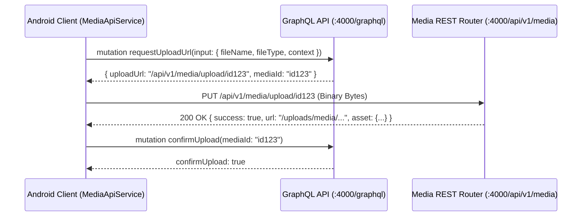
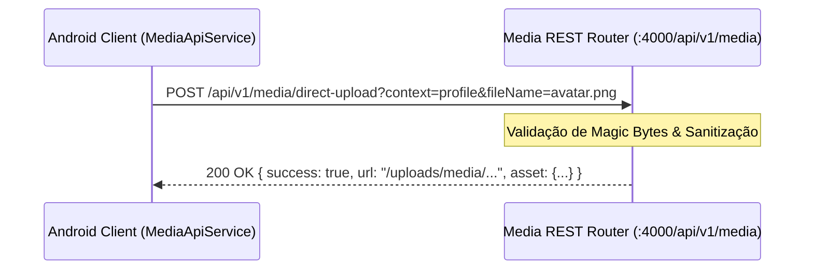

# Design Técnico: Prontidão de Produção do Aplicativo Android Workix

## Arquitetura de Comunicação e Upload de Mídia

O Android utiliza uma arquitetura baseada em Coroutines, OkHttp e GraphQL manual/Apollo para consumo do ecossistema Workix.

### 1. Fluxo de Upload em 2 Etapas (Presigned / Local Backend REST)

### 2. Fluxo de Upload Direto (Single-Step Multipart/Binary)

## Tratamento de Erros e Resiliência

- `NetworkResult<T>` é utilizado universalmente para envelopar respostas em `NetworkResult.Success(data)` ou `NetworkResult.Error(message)`.
- Se o servidor retornar erros GraphQL ou HTTP 4xx/5xx, o erro é propagado de forma amigável ao usuário sem quebrar a UI ou recorrer a dados fictícios.
