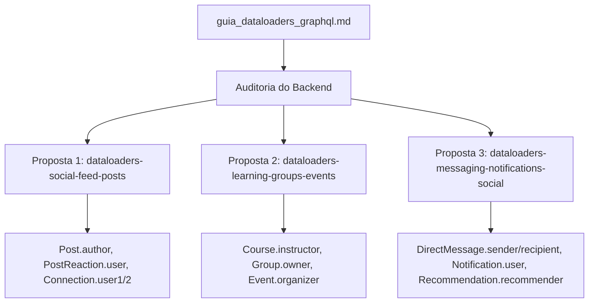

# Relatório Técnico: Estudo Arquitetural e Propostas de DataLoader no Backend GraphQL

## 1. Sumário Executivo

Este relatório consolida a auditoria arquitetural realizada na base de código **Workix GraphQL API** à luz das diretrizes estabelecidas no [guia_dataloaders_graphql.md](file:///d:/Packsys/NetBeansProjects/graphql/guia_dataloaders_graphql.md).

O estudo analisou todos os **32 módulos**, **64 modelos relacionais Sequelize** e esquemas GraphQL para identificar onde o padrão DataLoader deve ser introduzido para mitigar problemas clássicos de **consultas N+1** em resoluções de entidades aninhadas, garantindo isolamento por requisição (request-scoped) e máxima eficiência de I/O.

---

## 2. Matriz de Decisão Arquitetural (Guia de Referência)

Conforme os princípios do [guia_dataloaders_graphql.md](file:///d:/Packsys/NetBeansProjects/graphql/guia_dataloaders_graphql.md), a aplicação de DataLoaders no projeto deve seguir rigorosamente a matriz abaixo:

| Cenário / Tipo de Consulta | Utilizar DataLoader? | Motivo / Diretriz Técnica |
| :--- | :---: | :--- |
| **Campos Aninhados e Relações ($1:1$, $1:N$, $N:1$)** | **SIM** | Elimina o gargalo $N+1$ transformando dezenas de queries em uma única busca com `WHERE id IN (...)`. |
| **Consultas Raiz (`Query.users`, `Query.socialFeed`)** | **NÃO** | A query raiz já executa uma busca direta via repositório. O loader acrescentaria sobrecarga inútil. |
| **Listas Paginadas e Filtros Dinâmicos** | **NÃO** | Filtros complexos (`status`, `dateRange`, `offset`) não se beneficiam de agrupamento de chave simples. |
| **Mutações (`Mutation.createPost`, etc.)** | **NÃO** | O cache em memória do loader pode mascarar dados persistidos recentemente. |
| **Consultas com Joins Otimizados na Raiz** | **NÃO** | Se o repositório já projeta os dados agregados, o DataLoader é redundante. |

---

## 3. Diagnóstico da Arquitetura Atual

### 3.1 Infraestrutura Existente (`src/dataloader.ts`)
A aplicação já dispõe de um `DataLoaderFactory` instanciado com escopo por requisição (`req['context']['dataloaders']` em `src/index.ts`), o que atende plenamente ao requisito de **Request-Scoped Lifecycle** (prevenindo vazamento de cache entre usuários).

### 3.2 Módulos Já Cobertos por DataLoaders
Os seguintes módulos já utilizavam o `DataLoaderFactory` em seus Field Resolvers:
- **`authors`**: `authorLoader`, `mediaLoader`
- **`blogs`**: `blogsLoader`, `commentsLoader`, `commentsParentLoader`, `picturesLoader`, `tagsLoader`, `categoriesLoader`, `commentsOwnerLoader`
- **`candidates`**: `candidatesLoader`, `resumesLoader`, `usersLoader`
- **`companies`**: `companiesLoader`, `companyMediaLoader`, `usersLoader`
- **`jaas`**: `rolesLoader`
- **`jobs`**: `jobsLoader`, `companiesLoader`, `candidatesLoader`
- **`members`**: `membersLoader`, `memberMediaLoader`
- **`resumes`**: `resumesLoader`, `educationsLoader`, `experiencesLoader`, `skillsLoader`
- **`selective_processes`**: `jobsLoader`, `candidatesLoader`
- **`testimonials`**: `authorLoader`

### 3.3 Lacunas Identificadas ($N+1$)
Módulos de alta frequência de leitura e expansão social que foram desenvolvidos com tipos planos (apenas IDs escalares) ou que demandavam Field Resolvers aninhados para expansão de nós:
1. **Feed Social e Conexões** (`posts`, `connections`, `hashtags`)
2. **Plataforma LMS, Comunidades e Eventos** (`learning`, `groups`, `events`)
3. **Comunicação Direta, Notificações e Endossos** (`messaging`, `notifications`, `endorsements`)

---

## 4. Propostas de Mudança OpenSpec Criadas

Para resolver essas lacunas de forma modular e auditável, foram criadas **3 propostas de alteração** com especificações completas (`proposal.md`, `specs/`, `design.md`, `tasks.md`):



### 4.1 Proposta 1: `dataloaders-social-feed-posts`
- **Módulos Afetados**: `src/modules/posts/`, `src/modules/connections/`
- **Objetivo**: Permitir a expansão de dados do autor do post (`Post.author`), usuário da reação (`PostReaction.user`), autor do comentário (`PostComment.author`) e participantes de conexões (`Connection.user1`, `Connection.user2`, `ConnectionRequest.requester`, `ConnectionRequest.recipient`).
- **Implementação**: Sub-resolvers consumindo `ctx.dataloaders.usersLoader`.

### 4.2 Proposta 2: `dataloaders-learning-groups-events`
- **Módulos Afetados**: `src/modules/learning/`, `src/modules/groups/`, `src/modules/events/`
- **Objetivo**: Resolver de forma agregada os instrutores de cursos (`Course.instructor`), aulas (`Course.lessons`), donos e membros de grupos (`Group.owner`, `GroupMembership.user`, `GroupPost.author`) e organizadores e inscritos em eventos (`Event.organizer`, `EventAttendee.user`).
- **Implementação**: Adição de `CourseLoader`, `GroupLoader`, `EventLoader` em `src/dataloader.ts` e Field Resolvers nos respectivos módulos.

### 4.3 Proposta 3: `dataloaders-messaging-notifications-social`
- **Módulos Afetados**: `src/modules/messaging/`, `src/modules/notifications/`, `src/modules/endorsements/`
- **Objetivo**: Resolver remetentes e destinatários de mensagens em tempo real (`DirectMessage.sender`, `DirectMessage.recipient`), destinatários de notificações (`Notification.user`) e recomendadores/endossantes (`Recommendation.recommender`, `SkillEndorsement.endorser`).
- **Implementação**: Field Resolvers delegando a resolução para `ctx.dataloaders.usersLoader`.

---

## 5. Roteiro de Execução Recomendado

Para implementar cada proposta utilizando o fluxo orientado a testes (TDD) e baby-steps:

1. **Executar Feed Social e Conexões**:
   ```bash
   /opsx-apply dataloaders-social-feed-posts
   ```
2. **Executar Cursos, Grupos e Eventos**:
   ```bash
   /opsx-apply dataloaders-learning-groups-events
   ```
3. **Executar Mensagens, Notificações e Endossos**:
   ```bash
   /opsx-apply dataloaders-messaging-notifications-social
   ```
